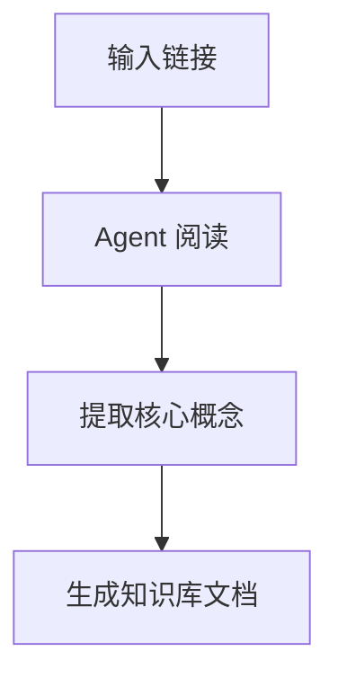
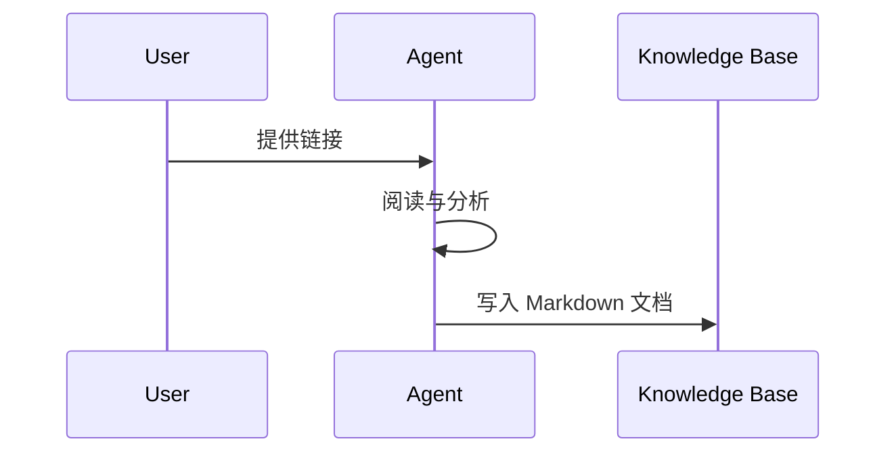

# AI Signal Radar 项目方案

## 1. 背景与目标

AI 领域的信息更新速度非常快，单纯依赖同事分享、偶尔浏览 GitHub Trending、阅读公众号或 newsletter，容易产生明显滞后。

本项目目标是建设一套面向个人和团队的 AI 情报系统：

- 第一时间发现 AI 领域高价值资讯、概念、开源项目和工程实践。
- 基于可解释规则、多源交叉验证和用户反馈，自动估算信息热度、可信度、相关性和跟进价值。
- 利用 Agent 自动阅读链接、GitHub 仓库、论文、博客和文档。
- 自动生成结构化知识库文档。
- 通过飞书群机器人作为 MVP 默认推送渠道，企业微信作为备选，Telegram、ntfy、Bark、邮件作为扩展渠道。
- 通过 Web/PC 工作台和任务提醒，把半自动总结流程变成可执行的每日学习闭环。
- 长期沉淀成个人或团队的 AI 知识库。

一句话定义：

> AI Signal Radar 是一个 AI 情报雷达 + 个人学习工作台 + Agent 知识库生产线。

---

## 2. 核心问题

当前痛点：

1. 信息发现滞后。
2. 热点项目很多，但难以判断哪些真正值得跟进。
3. AI 大佬、公司博客、GitHub、论文、社区讨论分散在不同平台。
4. 即使发现链接，也需要花时间阅读、理解、试用和总结。
5. 看过的信息没有系统沉淀，难以形成长期知识资产。
6. 半自动流程依赖人的主动性，如果没有任务提醒和完成反馈，很容易因为惰性导致知识库长期不更新。

本项目要解决的问题：

1. 自动发现信号。
2. 自动筛选信号。
3. 自动解释信号。
4. 自动生成知识库。
5. 自动推送给用户。
6. 把“发现、推送、处理、提交、归档”做成每日任务闭环。
7. 根据用户反馈持续优化排序。

---

## 3. 总体流程

```text
高质量信源采集
    ↓
内容清洗、去重、链接抽取、实体识别
    ↓
热度、质量、相关性评分
    ↓
生成今日候选任务
    ↓
飞书推送今日待办
    ↓
Web/PC 工作台跟踪任务状态
    ↓
用户使用 Codex / Antigravity 生成 Markdown 文档
    ↓
提交到 knowledge-base/
    ↓
系统检测文档并完成任务
    ↓
用户反馈反哺评分模型
```

---

## 4. 信息源设计

### 4.1 AI 人物与公司一手信源

重点监控 AI 领域关键人物和机构的一手发布。

代表人物：

- Andrej Karpathy
- Sam Altman
- Greg Brockman
- Demis Hassabis
- Jeff Dean
- Dario Amodei
- Yann LeCun
- Francois Chollet
- Simon Willison
- swyx
- Harrison Chase
- Jeremy Howard
- Jim Fan
- Thomas Wolf
- Clement Delangue

代表机构：

- OpenAI
- Anthropic
- Google DeepMind
- Meta AI
- NVIDIA
- Mistral AI
- Hugging Face
- LangChain
- Cursor
- GitHub
- Vercel
- Qwen
- DeepSeek

采集内容：

- X / Twitter 帖子
- Bluesky
- Mastodon
- LinkedIn
- 个人博客
- 官方博客
- Release Notes
- Changelog
- 文档更新
- 帖子中提到的 GitHub、论文、产品、文章链接

注意：

- X API 当前已经变成 pay-per-use / credit 模式，采集成本需要控制。
- 第一阶段建议只监控核心账号，不做全网 X 搜索。

### 4.2 GitHub 热点项目

GitHub 不应只看总 star，更应关注增长速度。

核心指标：

- 1 小时 star 增长
- 24 小时 star 增长
- 7 天 star 增长
- fork 增长
- issue 活跃度
- PR 活跃度
- release 频率
- contributor 增长
- README 关键词
- 是否被关键人物或机构引用

重点关键词：

关键词需要持续更新。MVP 阶段建议先按主题分层维护，而不是只维护一串平铺关键词。

Agent 与工程范式：

- AI agent
- agentic AI
- agentic engineering
- agent engineering
- coding agent
- software engineering agent
- autonomous agent
- long-horizon agent
- multi-agent
- sub-agent
- deep agent
- computer use agent
- browser agent
- research agent
- AI coworker
- AI engineer
- agent framework
- agent runtime
- agent orchestration
- agent workflow
- agent memory
- persistent agent
- durable agent
- self-improving agent
- self-evolving agent

Agent 标准、协议与上下文：

- MCP
- MCP server
- Model Context Protocol
- A2A
- agent protocol
- AGENTS.md
- agent README
- agent context file
- context engineering
- context management
- context compression
- auto-compaction
- tool calling
- function calling
- structured output
- tool use
- tool registry
- connector
- plugin
- extension

Skills、Harness 与可复用能力：

- skills
- AI skills
- agent skills
- Claude skills
- skill registry
- skill marketplace
- skill evolution
- harness engineering
- agent harness
- coding harness
- evaluation harness
- workflow harness
- deterministic workflow
- repeatable workflow
- guardrails
- policy-as-code
- sandbox

AI 编程与开发者工具：

- vibe coding
- AI coding assistant
- AI IDE
- terminal agent
- CLI agent
- repo-native agent
- code review agent
- code generation
- code repair
- test generation
- refactoring agent
- PR agent
- issue agent
- agentic CI/CD
- GitHub agentic workflows
- natural language workflow
- dev environment automation

RAG、知识库与数据处理：

- RAG
- agentic RAG
- GraphRAG
- vector database
- embeddings
- reranker
- retrieval
- knowledge base
- document processing
- file-to-Markdown
- PDF parsing
- OCR
- data extraction
- enterprise search
- memory layer
- personal knowledge base

模型运行、推理与本地化：

- local LLM
- local inference
- inference engine
- model serving
- LLM runtime
- edge inference
- quantization
- GGUF
- llama.cpp
- vLLM
- SGLang
- Ollama
- Open WebUI
- multimodal model
- speech model
- vision-language model

评测、安全与生产化：

- eval
- evaluation
- benchmark
- SWE-bench
- agent benchmark
- coding benchmark
- observability
- tracing
- monitoring
- hallucination detection
- prompt injection
- AI security
- red teaming
- governance
- reliability
- production agent
- enterprise agent

产品与开源生态：

- LLM tools
- AI assistant
- AI workflow
- workflow automation
- no-code AI
- low-code AI
- self-hosted AI
- open-source AI
- AI productivity
- AI automation
- model router
- provider-agnostic
- API gateway
- proxy
- web scraping

可用数据源：

需要区分官方一手数据源、第三方趋势源和自建数据资产。所有外部数据源都必须在配置中保留官方参考链接或可信入口，避免接入钓鱼网站、仿冒 API 或来源不明的镜像站。

一级主数据源：

| 数据源 | 类型 | 可信度 | 用途 | 官方或可信参考链接 |
|---|---|---:|---|---|
| GitHub REST API | GitHub 官方 API | 高 | 仓库元数据、star、fork、issue、release、contributors | https://docs.github.com/rest |
| GitHub GraphQL API | GitHub 官方 API | 高 | 精准组合查询仓库、issue、PR、release、贡献者等数据 | https://docs.github.com/graphql |
| 自建 GitHub 仓库快照表 | 自建数据资产 | 高 | 计算 1 小时、24 小时、7 天 star/fork/issue/release 增长 | 使用 GitHub 官方 API 定时采集 |

二级趋势参考源：

| 数据源 | 类型 | 可信度 | 用途 | 官方或可信参考链接 |
|---|---|---:|---|---|
| GitHub Trending | GitHub 官方公开页面 | 中 | 发现今日、本周社区热门项目 | https://github.com/trending |
| OSSInsight AI Trending | 第三方开源趋势平台 | 中高 | 观察 AI agents、coding agents、MCP、RAG、inference 等分类趋势 | https://ossinsight.io/trending/ai |
| OSSInsight Collections | 第三方开源趋势平台 | 中高 | 查看特定技术集合的长期趋势 | https://ossinsight.io/collections |

三级辅助验证源：

| 数据源 | 类型 | 可信度 | 用途 | 官方或可信参考链接 |
|---|---|---:|---|---|
| Hacker News API | HN 官方公开 API | 中高 | 验证开发者社区讨论热度 | https://github.com/HackerNews/API |
| Hugging Face Papers Trending | Hugging Face 官方页面 | 中高 | 验证论文和研究方向热度 | https://huggingface.co/papers/trending |
| arXiv API | arXiv 官方 API | 高 | 获取论文元数据、摘要、作者和发布时间 | https://arxiv.org/help/api/user-manual |

使用原则：

- 真正可信的增长速度优先依赖自建 GitHub 快照表，而不是只看 GitHub Trending 或第三方榜单。
- GitHub Trending 和 OSSInsight 适合作为发现入口和交叉验证，不作为唯一判断依据。
- 第三方趋势源必须保留原始 GitHub 仓库链接，并回到 GitHub 官方 API 校验仓库数据。
- 所有数据源域名应写入 allowlist，例如 `github.com`、`api.github.com`、`docs.github.com`、`ossinsight.io`、`huggingface.co`、`arxiv.org`、`news.ycombinator.com`、`hacker-news.firebaseio.com`。
- 不从不明镜像站、短链接、广告跳转页或未经确认的 API 域名采集数据。
- 推送和知识库文档中保留原始来源链接，方便人工复核。

### 4.3 论文与研究趋势

重点来源：

- arXiv
- Hugging Face Papers Trending
- Papers with Code
- AlphaXiv
- OpenAI Research
- Anthropic Research
- Google Research
- Meta AI Research
- Microsoft Research
- NVIDIA Research

重点分类：

- cs.AI
- cs.LG
- cs.CL
- cs.CV
- cs.SE

判断维度：

本项目仍然关注学术研究，但默认优先级低于工程应用、公司产品、开源项目和可实践技术报告。只有当学术论文已经出现工程化迹象，或明显会影响 AI 应用趋势时，才提升优先级。

因此，论文与研究趋势不以纯学术 novelty 为第一优先级，而是以“是否能学习、试用、复现、转化为工程认知”为核心。重点跟踪来自大公司、开源社区、工程团队、开发者工具团队的研究和技术报告。

高优先级信号：

- 是否有 GitHub 项目代码。
- 是否有清晰的 README、quickstart、examples 或 tutorial。
- 是否有项目主页、demo、在线 playground 或可运行 notebook。
- 是否有官方文档、API 文档、SDK 文档或部署说明。
- 是否由 OpenAI、Anthropic、Google DeepMind、Meta AI、NVIDIA、Microsoft、Hugging Face、LangChain、GitHub、Qwen、DeepSeek 等公司或高可信开源团队发布。
- 是否已经形成开源项目、工具库、框架、模型、数据集或 benchmark。
- 是否被开发者社区实际讨论和试用，例如 GitHub issue、HN 讨论、Reddit 讨论、X 讨论。
- 是否能解释一个正在出现的工程趋势，例如 MCP、Skills、Harness Engineering、Agentic Engineering、Coding Agent、RAG、Eval、Local Inference。
- 是否有明确的使用场景，而不只是理论指标提升。

中优先级信号：

- 是否被 Hugging Face Papers 顶上趋势榜。
- 是否被关键人物转发或评论。
- 是否提出新范式、新 benchmark、新评测方法。
- 是否已经出现多个第三方复现项目。
- 是否有公司博客、技术博客或工程解读文章。

降权信号：

- 只有论文，没有代码、文档、demo 或项目主页。
- 只有 benchmark 分数，没有清晰工程使用场景。
- 代码仓库为空、不可运行或长期未维护。
- README 缺少安装说明、使用示例和 license。
- 只有学术讨论价值，短期难以转化为学习材料或实践项目。
- 论文标题很热，但社区没有真实试用反馈。

推荐处理方式：

- 有 GitHub + 文档 + demo 的论文或技术报告：进入高优先级总结队列。
- 有 GitHub 但文档不足：进入观察队列，等待 README、examples、release 完善。
- 只有论文但来自大公司或关键团队：生成短摘要，不做深度实践文档。
- 纯学术论文：不丢弃，但默认进入低优先级观察队列；如果后续出现 GitHub 实现、公司产品化、开源社区复现或关键人物解读，再提升优先级。

### 4.4 开发者社区与早期信号

社区信号往往早于媒体报道。

重点来源：

- Hacker News
- Reddit: r/LocalLLaMA
- Reddit: r/MachineLearning
- Reddit: r/ArtificialInteligence
- Product Hunt
- Discord 社区
- Slack 社区
- YouTube / Podcast transcript

重点关注：

- Show HN 新项目
- 开发者真实试用反馈
- 开源项目争议
- 早期概念讨论
- 工具链迁移趋势

### 4.5 Newsletter 与人工精选源

这些来源适合作为二级验证和补充。

推荐来源：

- Latent Space
- Import AI
- The Batch
- TLDR AI
- Ben's Bites
- AI News
- Ahead of AI
- Simon Willison Blog
- The Pragmatic Engineer

注意：

- Newsletter 通常质量较高，但可能滞后。
- 不建议只依赖 newsletter 作为主信源。

### 4.6 文档和 Changelog

很多真正重要的变化不是新闻，而是文档、SDK 或 changelog 更新。

重点监控：

- OpenAI Docs
- Anthropic Docs
- Gemini Docs
- GitHub Copilot Docs
- Cursor Changelog
- LangChain Changelog
- Vercel AI SDK Changelog
- Hugging Face Changelog
- MCP 相关 registry 和文档
- SDK release notes
- model card 更新
- benchmark leaderboard 更新

---

## 5. 信号评分模型

每条信息生成一个 Signal Score，用于决定是否推送、是否总结、是否进入知识库。

需要明确：Signal Score 不是行业公认的绝对标准，也不是让 AI 主观判断“这个一定重要”。它应该被设计成一个可解释、可审计、可调整的决策辅助系统。

更准确的目标是：

```text
基于可解释规则、多源交叉验证和用户反馈，估算每条信息的建议优先级。
```

因此，系统输出不应被视为最终结论，而应被视为“是否值得优先查看、总结、跟进”的建议。

建议初始权重：

```text
Signal Score =
  新鲜度 20%
+ 增长速度 25%
+ 信源权威度 20%
+ 跨平台共振 15%
+ 与用户兴趣相关性 15%
+ 可行动性 5%
```

### 5.0 可解释判断规则

自动判断应优先依赖可解释规则，而不是只让 LLM 给出主观结论。

核心判断维度：

- 增长速度：关注 24 小时、7 天 star 增长，而不是只看总 star。
- 开发活跃度：查看最近 commit、release、issue、PR 是否持续发生。
- 社区健康度：查看贡献者数量、issue 回复速度、是否有人真实使用。
- 信源权威度：判断是否被 OpenAI、Anthropic、Google、Karpathy、Simon Willison 等关键机构或人物提及。
- 跨平台共振：判断是否同时出现在 GitHub、Hacker News、X、Hugging Face、Reddit、newsletter 等多个平台。
- 可行动性：判断是否有代码、文档、demo、license、examples，是否可以快速试用或学习。
- 风险信号：判断是否存在突然暴涨但无代码、无文档、issue 全是报错、license 不清晰、README 过度营销等问题。

GitHub 项目建议至少检查：

- stars_total
- stars_24h_delta
- stars_7d_delta
- forks_delta
- latest_commit_at
- latest_release_at
- open_issues_count
- issue_response_speed
- pull_request_activity
- contributors_count
- readme_quality
- license
- examples_or_demo
- external_mentions

论文和文章建议至少检查：

- 是否来自官方、arXiv、顶会、研究机构或高可信个人博客。
- 是否有代码、项目主页或 demo。
- 是否被关键人物、Hugging Face Papers、社区平台引用。
- 是否提出新概念、新 benchmark、新方法，还是只是常规改进。
- 是否有可落地的工程启发。

社区和社交媒体信号建议至少检查：

- 是否来自高可信账号。
- 是否包含原始链接，而不是二次转述。
- 是否有多个独立来源讨论同一内容。
- 是否存在夸张营销、标题党或缺少证据的问题。

风险降权规则：

- 只有 star 暴涨，但没有文档、demo、release：降权。
- README 只写愿景，没有实际代码：降权。
- issue 大量集中在无法运行、安装失败、关键功能缺失：降权。
- license 缺失或不适合商用：标记风险。
- 外部讨论高度集中在单一账号或单一平台：降低跨平台共振分。
- 项目长期无 commit 或 release：降低跟进优先级。

### 5.1 新鲜度

越新越高。

示例：

- 1 小时内：高分
- 24 小时内：中高分
- 7 天内：中分
- 超过 30 天：默认低分，除非长期热度很高

### 5.2 增长速度

适用于 GitHub、Hugging Face、社区讨论等。

示例：

- GitHub 24 小时新增 star 超过 1000：高分
- 7 天持续增长：高分
- 只有总 star 高但近期无增长：降低分数

### 5.3 信源权威度

示例：

- OpenAI、Anthropic、Google DeepMind 官方发布：高分
- Karpathy、Simon Willison 等关键人物提及：高分
- 普通搬运媒体：中低分

### 5.4 跨平台共振

同一项目或概念如果同时出现在多个平台，说明可能形成趋势。

示例：

- GitHub 暴涨 + HN 热议 + X 多人讨论：高分
- 只在单一平台出现：中低分

### 5.5 用户兴趣相关性

根据用户重点方向加权。

当前建议重点方向：

- AI Agent
- Coding Agent
- MCP
- Skills
- Context Engineering
- Harness Engineering
- Workflow Automation
- RAG
- Eval
- Local Inference
- 开源 AI 工具链

### 5.6 可行动性

判断用户是否可以立即学习、试用或应用。

高分示例：

- 有 GitHub 仓库
- 有 demo
- 有文档
- 有可运行 examples
- 有清晰使用场景

低分示例：

- 只有概念宣传
- 没有代码
- 没有技术细节
- 无法验证

---

## 6. Agent 分析能力

系统应支持输入任意链接，自动生成知识库文档。

MVP 阶段采用半自动 Agent 工作流：

- 系统自动采集链接、项目、论文和热点信号。
- 系统先用规则评分生成待总结队列。
- 用户使用已有的 Codex / Antigravity 配额触发深度总结。
- Agent 输出结构化 Markdown 文档并写入知识库。
- 等流程验证有效后，再接入 OpenAI、Anthropic、Gemini 或本地模型 API，实现全自动总结。

这样第一阶段不需要先购买额外 LLM API key，也不会因为模型 API 成本阻塞项目启动。需要明确：半自动只是 MVP 阶段的过渡方案，系统设计必须保留后续接入 API key 并升级为全自动的能力。

文档可视化策略：

- 默认生成 Markdown 文档。
- 简单项目、普通新闻、短博客只生成文字总结。
- 复杂概念、系统架构、协议关系、源码模块关系，默认附 Mermaid 图。
- Mermaid 图由文本 LLM 生成，不需要图片生成模型，成本较低且便于版本管理。
- 后续阶段再把 Mermaid 渲染成 SVG / PNG，用于飞书推送、周报和可视化知识库。
- MVP 阶段不优先使用图片生成模型生成架构图，避免额外 token、credit 或服务成本。

支持输入类型：

- GitHub 仓库
- 论文链接
- 博客文章
- 官方文档
- X thread
- Hacker News 讨论
- Product 页面
- YouTube 视频
- PDF

### 6.1 通用文档模板

```markdown
# 项目或概念名称

## 一句话总结

## 它解决什么问题

## 为什么突然火了

## 核心机制

## 和已有方案的区别

## 技术架构

## 架构图

复杂概念或系统型项目需要生成 Mermaid 图。简单内容可以省略。



## 核心流程图

复杂流程需要生成 Mermaid 图。简单内容可以省略。



## 适用场景

## 局限与风险

## 值不值得跟进

## 5 分钟上手

## 相关链接

## 我的学习建议
```

### 6.2 GitHub 项目分析模板

```markdown
# 项目名称

## 一句话总结

## 项目定位

## 为什么值得关注

## Star / Fork / Release 趋势

## 核心功能

## 技术架构

## 快速开始

## 代码结构

## 适合什么场景

## 不适合什么场景

## 与同类项目对比

## License 与商用风险

## 社区活跃度

## 当前问题与风险

## 后续跟进建议
```

### 6.3 论文分析模板

```markdown
# 论文标题

## 一句话总结

## 研究问题

## 核心贡献

## 方法概述

## 实验结果

## 是否有代码

## 工程落地难度

## 与已有工作的关系

## 可能影响的方向

## 值不值得深读

## 延伸阅读
```

---

## 7. 知识库结构

建议使用 Markdown 作为主存储格式，便于版本管理和迁移。

核心原则：

- 本项目的 `knowledge-base/` 是唯一主知识库。
- Codex / Antigravity 生成的最终知识库文档，优先直接写入本项目目录。
- 飞书、企业微信、Telegram、邮件只作为通知渠道和阅读入口，不作为主存档。
- Obsidian、Notion、语雀、有道云笔记、飞书文档可以作为后续同步层或阅读层。
- 第一阶段优先做好 Markdown-first，不绑定任何单一笔记平台。

推荐工作流：

```text
系统采集和初筛
    ↓
飞书推送待处理热点列表
    ↓
用户挑选值得深挖的链接
    ↓
使用 Codex / Antigravity 生成知识库 Markdown
    ↓
文档写入本项目 knowledge-base/
    ↓
日报 / 周报推送时附上已归档文档列表
```

目录结构：

```text
knowledge-base/
  daily/
    2026-04-22.md
  weekly/
    2026-W17.md
  projects/
    opencode.md
    openclaw.md
    deepagents.md
  concepts/
    mcp.md
    skills.md
    harness-engineering.md
    context-engineering.md
  people/
    karpathy.md
    sam-altman.md
  companies/
    openai.md
    anthropic.md
    google-deepmind.md
  comparisons/
    coding-agents-2026.md
    mcp-vs-skills-vs-harness.md
assets/
  mermaid/
  images/
exports/
  notion/
  yuque/
  feishu/
```

每篇文档建议保留元数据：

```yaml
title: Harness Engineering
type: concept
source_url: https://openai.com/index/harness-engineering/
source_type: official_blog
fetched_at: 2026-04-22T10:00:00+08:00
signal_score: 91
confidence: high
tags:
  - coding-agent
  - harness-engineering
  - agent-engineering
related:
  - context-engineering
  - skills
  - mcp
```

外部笔记兼容策略：

| 平台 | MVP 支持方式 | 后续增强 |
|---|---|---|
| Obsidian | 直接打开 `knowledge-base/` 目录 | 增加双链、标签、Dataview 元数据 |
| Notion | 手动导入 Markdown | Notion API 同步精选文档 |
| 语雀 | 手动导入 Markdown | 语雀 API 同步精选文档 |
| 有道云笔记 | 手动导入 Markdown 或文本 | 视 API 能力决定是否自动同步 |
| 飞书文档 | 不作为 MVP 主存储 | 使用飞书 Docs API 同步周报或精选文档 |

同步原则：

- Markdown 文件是主版本。
- 外部平台是副本或阅读层。
- 如果外部平台内容被编辑，应尽量回写到 Markdown，避免多处版本分叉。
- 第一阶段不做多平台双向同步，避免复杂度过高。

---

## 8. 推送机制

推送分为三类：实时快讯、每日雷达、每周报告。

MVP 默认推送策略：

- 默认渠道：飞书群机器人 Webhook。
- 备选渠道：企业微信群机器人 Webhook。
- 扩展渠道：Telegram Bot、ntfy、Bark、邮件 SMTP。

选择飞书作为 MVP 默认渠道的原因：

- 个人免费账号也可以使用。
- 可以创建只有自己的飞书群。
- 群内添加自定义机器人即可获得 Webhook URL。
- 后端只需要通过 HTTP POST 即可推送消息。
- 后续如果扩展到团队使用，飞书群也可以自然承接。

飞书使用边界：

- 飞书群机器人只负责推送摘要、评分、原始链接、本地知识库路径和待处理动作。
- 飞书不作为 MVP 的主知识库存档。
- 生成长文档本身会消耗 Codex / Antigravity / LLM 配额，飞书发送消息不会消耗 LLM token。
- 不建议把完整长文档都发到飞书群，阅读体验差，也不利于版本管理。
- 如果未来需要把内容保存成飞书文档，应使用飞书开放平台 Docs API，作为第二阶段或第三阶段能力。

MVP 需要准备的配置：

```text
PUSH_CHANNEL=feishu
FEISHU_WEBHOOK_URL=https://open.feishu.cn/open-apis/bot/v2/hook/xxxxxx
```

### 8.1 实时快讯

触发条件：

- 核心人物发布高相关内容。
- GitHub 项目 24 小时内暴涨。
- OpenAI、Anthropic、Google、NVIDIA 等发布重大内容。
- 同一概念在多个平台同时出现。
- 用户关注的关键词出现重大更新。

推送格式：

```text
[高优先级] OpenAI 发布 Harness Engineering 文章

为什么重要：
这可能代表 coding agent 工程范式从 prompt engineering 走向 harness engineering。

你需要看：
1. 原文
2. 3 分钟摘要
3. 和 MCP / Skills / Context Engineering 的关系

链接：
...
```

任务式推送格式：

```text
今日 AI 学习任务

已完成：
- 自动发现 42 条信号
- 筛选出 6 条高价值信号
- 今日热点已推送

请你今天完成：
1. 从 6 条候选信号里选择 1 到 3 条深挖
2. 至少提交 1 篇 Markdown 知识库文档

入口：
http://localhost:3100/today
```

### 8.2 每日 AI 雷达

每天固定时间推送。

内容：

- 今日 10 个重要信号
- 今日 3 个值得深读内容
- 今日 GitHub 增长最快 AI 项目
- 今日新概念
- 今日可跳过噪音
- 已自动生成的知识库文档

### 8.3 每周深度报告

每周一次。

内容：

- 本周最重要趋势
- 本周最值得试用项目
- 本周新增概念
- 本周 GitHub 项目榜
- 本周论文榜
- 本周知识库新增内容
- 下周学习建议

---

## 9. Learning Ops 工作台

半自动阶段最大的风险不是技术不可行，而是用户收到热点后没有及时处理，导致“推送很多、沉淀很少”。因此 MVP 必须包含一个轻量的 Learning Ops 工作台，把每日学习动作产品化。

目标：

- 把 AI 热点从“信息流”变成“今日任务”。
- 明确今天需要完成什么、已经完成什么、还差什么。
- 主动提醒用户处理待总结内容。
- 检测知识库文档是否提交，并自动完成任务。
- 降低人的惰性对系统效果的影响。

### 9.1 每日任务闭环

```text
系统发现热点
    ↓
自动生成今日候选任务
    ↓
飞书推送今日待办
    ↓
Web/PC 工作台显示今日任务
    ↓
用户点击开始处理
    ↓
复制 Codex / Antigravity Prompt
    ↓
生成 Markdown 知识库文档
    ↓
上传、粘贴或直接写入 knowledge-base/
    ↓
系统检测文档存在
    ↓
任务自动完成
    ↓
飞书提醒今日知识库任务已完成
```

### 9.2 任务状态

每条高价值信号都应该变成一个可跟踪任务。

```text
discovered       已发现
pushed           已推送
selected         已选择深挖
in_progress      处理中
doc_submitted    文档已提交
reviewed         已审核
archived         已归档
skipped          已跳过
snoozed          稍后提醒
```

状态流转示例：

```text
discovered → pushed → selected → in_progress → doc_submitted → reviewed → archived
```

跳过或延期：

```text
discovered → pushed → skipped
discovered → pushed → snoozed → pushed
```

### 9.3 今日工作台

MVP 页面重点不是复杂 UI，而是让用户能顺手完成每日动作。

今日工作台应展示：

```text
今日 AI 学习任务

[已完成] 今日热点已推送到飞书
[待处理] 从候选信号中选择 1 到 3 个深挖
[待处理] 为选中的信号生成知识库 Markdown
[待处理] 审核并归档今日文档

今日进度：1 / 4
```

每条信号提供操作：

- 深挖
- 跳过
- 稍后提醒
- 生成 Codex Prompt
- 复制 Antigravity Prompt
- 标记处理中
- 提交 Markdown
- 标记已审核

### 9.4 文档提交方式

MVP 支持三种提交方式：

1. 直接粘贴 Markdown 内容。
2. 上传 `.md` 文件。
3. 指定 `knowledge-base/` 下的文件路径，由系统检测文件是否存在。

推荐默认方式：

- 如果用户在 Codex 中操作，优先让 Codex 直接写入本项目 `knowledge-base/`。
- 如果用户在 Antigravity 或其他工具中生成内容，可以复制 Markdown 到 Web 页面提交。

### 9.5 Prompt 生成

工作台应为每条信号自动生成可复制的 Codex / Antigravity Prompt。

示例：

```text
请阅读以下链接，并按照项目知识库模板生成 Markdown 文档。

要求：
1. 保存到 knowledge-base/projects/{slug}.md
2. 使用中文总结
3. 包含来源链接和抓取时间
4. 如果是复杂项目，附 Mermaid 架构图或流程图
5. 分析适用场景、局限、风险和后续学习建议
6. 不要把没有来源依据的猜测写成事实

链接：
{source_url}
```

### 9.6 提醒策略

建议提醒节奏：

- 早上 9:00：推送今日 AI 雷达和候选任务。
- 晚上 20:00：如果没有选择深挖任务，提醒选择 1 到 3 个。
- 晚上 22:00：如果已选择但未提交文档，提醒完成至少 1 篇 Markdown。
- 次日早上：如果未完成，自动转入 snoozed 或降低任务数量。

提醒原则：

- 每天最多推荐 3 个深挖任务。
- 每天最低目标是完成 1 篇知识库文档。
- 如果连续多天未完成，系统应减少推送数量，而不是制造更多压力。
- 用户可以一键跳过、稍后提醒或降低今日任务量。

### 9.7 完成判定

任务完成不应只依赖用户主观点击。

可用判定方式：

- 检测 `knowledge-base/` 中是否出现目标 Markdown 文件。
- 检测文档 frontmatter 是否包含对应 `source_url`。
- 检测文档是否包含必要章节，例如一句话总结、来源链接、风险、学习建议。
- 用户手动点击“标记已完成”作为兜底。

---

## 10. 技术架构

架构演进原则：

- MVP 阶段优先本地运行 + 半自动总结 + 本地 Markdown 知识库。
- 后续支持接入 LLM API key，升级为全自动采集、总结、写库、推送。
- 后续支持云端部署与本地部署并存，例如 Vercel + Supabase 作为云端形态，本地 FastAPI / Next.js / PostgreSQL 作为本地形态。
- 本地和云端之间需要设计同步能力，避免知识库、任务状态、用户反馈分裂。
- API key、Webhook、GitHub token 等敏感配置必须使用环境变量或云端 secret manager，不写入知识库和 Git 仓库。

推荐部署形态：

| 阶段 | 形态 | 说明 |
|---|---|---|
| MVP | 本地部署 | 适合快速开发，直接写入本地 `knowledge-base/`，使用 Codex / Antigravity 半自动生成文档 |
| 第二阶段 | 本地为主，云端辅助 | 本地保留 Markdown 主知识库，云端负责定时采集、推送和轻量 Web 工作台 |
| 第三阶段 | 云端 + 本地同步 | Vercel 部署前端，Supabase 提供数据库、认证、定时任务或边缘函数，本地保留可编辑 Markdown 知识库 |
| 后续 | 全自动 Agent | 接入 LLM API key，自动生成日报、周报、项目文档和 Mermaid 图 |

云端建议组合：

- Vercel：部署 Next.js 前端、Today Workspace、Signal Feed、Knowledge Base 浏览页。
- Supabase：PostgreSQL、pgvector、Auth、Storage、Edge Functions、定时任务或 webhook 处理。
- GitHub：存储 Markdown 知识库和版本历史。
- 飞书机器人：推送任务提醒和完成反馈。

本地建议组合：

- FastAPI：本地后端和采集服务。
- PostgreSQL / SQLite：本地数据存储。MVP 可以先 SQLite，后续迁移 PostgreSQL。
- `knowledge-base/`：本地 Markdown 主知识库。
- Codex / Antigravity：半自动文档生成和项目内写文件。

同步策略：

- 任务、信号、评分、反馈存数据库。
- Markdown 文档以本地 `knowledge-base/` 或 Git 仓库为主版本。
- 云端数据库保存文档索引、元数据、source_url、tags、status，不必强制保存完整 Markdown 正文。
- 云端和本地通过 Git、API 或导入任务进行同步。
- 如果云端生成了文档，应创建 Pull Request 或同步任务，而不是直接覆盖本地文档。

### 10.1 后端

建议技术栈：

- Python
- FastAPI
- PostgreSQL
- pgvector
- Redis
- Celery 或 Dramatiq
- Playwright
- Feedparser
- GitHub REST API
- GitHub GraphQL API
- arXiv API
- Hugging Face API
- Supabase，可作为云端 PostgreSQL / pgvector / Auth / Storage 方案

后端模块：

- Source Manager：信源管理
- Collector：采集器
- Parser：内容解析
- Deduplicator：去重
- Entity Extractor：实体识别
- Scoring Engine：评分引擎
- Agent Orchestrator：Agent 调度
- Knowledge Writer：知识库生成
- Task Loop：每日任务和状态流转
- Reminder Scheduler：提醒调度
- Document Submission：Markdown 提交和检测
- Sync Service：本地与云端同步
- Secret Manager：API key、Webhook、token 配置管理
- Notification Service：推送服务
- Feedback Service：用户反馈

### 10.2 前端

建议技术栈：

- Next.js
- React
- Tailwind CSS
- shadcn/ui
- Vercel，可作为云端前端部署方案

核心页面：

- Today Workspace：今日学习工作台
- Signal Feed：信息流
- GitHub Radar：GitHub 热点项目
- People Watchlist：人物监控
- Knowledge Base：知识库
- Concept Map：概念图谱
- URL Summarizer：链接总结
- Task Queue：待处理任务
- Document Submit：文档提交
- Feedback 面板
- Settings：信源和推送配置

### 10.3 Agent 层

建议拆分为多个专职 Agent：

- Collector Agent：采集和清洗
- Link Extractor Agent：抽取链接、项目、论文、人物
- Trend Analyst Agent：判断为什么火
- Repo Analyst Agent：分析 GitHub 项目
- Paper Analyst Agent：分析论文
- Knowledge Writer Agent：生成知识库文档
- Push Editor Agent：生成推送摘要
- Auto Summary Agent：后续 API key 模式下自动生成知识库文档
- Sync Agent：同步云端任务、数据库索引和本地 Markdown 文档

---

## 11. 数据模型草案

### 11.1 Source

```text
id
name
type
url
platform
priority
enabled
poll_interval
created_at
updated_at
```

### 11.2 Signal

```text
id
title
url
source_id
source_type
raw_content
summary
published_at
fetched_at
signal_score
freshness_score
velocity_score
authority_score
resonance_score
relevance_score
actionability_score
status
created_at
updated_at
```

### 11.3 Entity

```text
id
name
type
canonical_url
metadata
created_at
updated_at
```

Entity type 示例：

- person
- company
- github_repo
- paper
- concept
- product
- model

### 11.4 Knowledge Document

```text
id
title
slug
type
path
source_url
content
summary
tags
confidence
created_by_agent
created_at
updated_at
```

### 11.5 User Feedback

```text
id
signal_id
feedback_type
comment
created_at
```

feedback_type 示例：

- useful
- not_useful
- deep_dive
- ignore_source
- follow_topic
- mark_as_noise

### 11.6 Learning Task

```text
id
signal_id
title
task_type
status
priority
source_url
target_doc_path
generated_prompt
selected_at
started_at
doc_submitted_at
reviewed_at
archived_at
snoozed_until
created_at
updated_at
```

task_type 示例：

- deep_dive
- repo_analysis
- concept_summary
- paper_summary
- daily_review

status 示例：

- discovered
- pushed
- selected
- in_progress
- doc_submitted
- reviewed
- archived
- skipped
- snoozed

### 11.7 Reminder

```text
id
task_id
reminder_type
scheduled_at
sent_at
channel
status
created_at
updated_at
```

### 11.8 Integration Credential

用于记录外部服务配置的元数据。敏感值不直接存明文，应存环境变量引用、secret key 名称或加密值。

```text
id
provider
credential_type
name
secret_ref
enabled
created_at
updated_at
```

provider 示例：

- openai
- anthropic
- gemini
- github
- feishu
- supabase
- notion
- yuque

credential_type 示例：

- api_key
- webhook_url
- oauth_token
- github_token
- service_role_key

### 11.9 Sync State

用于记录本地和云端的数据同步状态。

```text
id
resource_type
resource_id
local_path
remote_id
remote_url
sync_status
last_synced_at
conflict_status
created_at
updated_at
```

sync_status 示例：

- local_only
- remote_only
- synced
- pending_upload
- pending_download
- conflict

---

## 12. MVP 范围

第一阶段目标是 2 到 3 周内做出可用版本。

### 12.1 MVP 功能

1. 监控 50 个核心人物、公司、博客、RSS、GitHub 源。
2. 监控 GitHub AI 关键词项目增长。
3. 接入 OSSInsight、GitHub Trending、Hugging Face Papers。
4. 每天生成一篇 `knowledge-base/daily/YYYY-MM-DD.md`。
5. 支持输入链接，使用 Codex / Antigravity 半自动生成知识库文档。
6. 默认支持飞书群机器人推送，企业微信群机器人作为备选。
7. 提供 Today Workspace 今日工作台，展示今日任务、进度、待处理信号和文档提交状态。
8. 支持为每条高价值信号生成 Codex / Antigravity Prompt。
9. 支持粘贴 Markdown、上传 `.md` 文件或指定 `knowledge-base/` 路径来提交文档。
10. 系统检测知识库文档后自动完成任务，并通过飞书提醒今日任务完成。
11. 提供简单 Web 后台查看信号列表、评分和摘要。

### 12.2 MVP 不做

第一阶段暂不做：

- 复杂推荐算法
- 全网 X 搜索
- 自动运行所有 GitHub 项目
- 完全自动化 LLM 总结
- 生产级 API key 管理和计费控制
- 云端与本地的完整双向同步
- 多用户权限系统
- 复杂可视化图谱系统
- 图片生成模型生成架构图
- 复杂项目管理系统
- 多人协作审批流
- 商业化计费

### 12.3 v0.1 开发范围冻结

v0.1 的目标不是完成完整平台，而是跑通最小可用闭环：

```text
发现热点 → 初步评分 → 飞书推送 → Today Workspace 待办 → Codex / Antigravity 半自动生成 Markdown → 提交知识库 → 任务完成提醒
```

v0.1 默认决策：

- 目标用户：先服务个人使用。
- 部署方式：先做本地版本。
- 知识库：Markdown-first，本项目 `knowledge-base/` 是主存档。
- 推送渠道：飞书群机器人优先。
- 总结方式：Codex / Antigravity 半自动。
- 数据源：GitHub + RSS / 官方博客 + Hacker News + Hugging Face Papers，暂不接 X API。
- 前端优先级：Today Workspace 优先于复杂信息流和图谱。
- 架构要求：虽然先做个人和本地版本，但接口、数据模型和配置方式要保留后续团队化、云端化和 API key 全自动能力，避免后期大规模返工。

v0.1 必须做：

1. GitHub AI 项目采集和快照。
2. RSS / 官方博客采集。
3. Signal Score 初版。
4. 飞书推送今日候选任务。
5. Today Workspace 今日工作台。
6. Codex / Antigravity Prompt 生成。
7. Markdown 文档提交和 `knowledge-base/` 路径检测。
8. 任务完成提醒。

v0.1 暂不做：

- X API。
- Notion / 语雀 / 有道云 / 飞书文档自动同步。
- 云端与本地双向同步。
- 自动 clone 和运行 GitHub 项目。
- 复杂 Agent 编排。
- 多用户权限。
- 复杂概念图谱。
- 全自动 LLM 总结。

### 12.4 v0.1 八项优化建议

#### 1. Phase 0：项目启动前确认

正式开发前先冻结以下默认选择：

```text
目标用户：个人
部署方式：本地
知识库：Markdown-first
推送：飞书群机器人
总结：Codex / Antigravity 半自动
数据源：GitHub + RSS + HN + HF Papers
前端：Today Workspace 优先
```

#### 2. MVP 进一步收敛

v0.1 只优先实现 5 个核心闭环：

1. GitHub AI 项目采集和快照。
2. RSS / 官方博客采集。
3. Signal Score 初版。
4. 飞书推送今日候选任务。
5. Today Workspace + Markdown 提交流程。

#### 3. 验收标准

v0.1 完成标准：

- 每天能采集 GitHub / RSS 信号。
- 能生成今日 Top 10 候选信号。
- 能推送到飞书。
- Web 页面能看到今日任务。
- 能为候选信号生成 Codex / Antigravity Prompt。
- 能提交 Markdown 文档。
- 提交后任务自动变成完成。
- `knowledge-base/` 中能看到归档文档。

#### 4. 成本和配额策略

v0.1 不依赖额外 LLM API key。后续接入 API key 后，默认策略：

- 低分信号：只存标题、链接和基础元数据，不调用 LLM。
- 中分信号：生成短摘要。
- 高分信号：生成完整知识库文档。
- 重复链接：直接走缓存。
- 每日自动总结数量设上限。
- API 调用日志记录 provider、模型、token / cost 估算、任务来源。

#### 5. 安全和密钥管理

安全默认规则：

- `.env` 不提交 Git。
- Webhook URL 不写入 Markdown 文档。
- GitHub token 使用最小权限。
- 飞书 webhook 如果支持签名校验，优先开启。
- 日志里不打印 token、API key、webhook URL。
- 本地和云端 secret 使用不同配置。
- 示例配置只提交 `.env.example`。

#### 6. 数据源注册表

建议使用 `sources.yaml` 或数据库表管理所有信源。

示例：

```yaml
- name: OpenAI Blog
  type: rss
  url: https://openai.com/news/rss.xml
  priority: high
  enabled: true
  official: true

- name: OSSInsight AI
  type: trend
  url: https://ossinsight.io/trending/ai
  priority: medium
  enabled: true
  official: false
```

数据源注册表字段建议：

- name
- type
- url
- priority
- enabled
- official
- tags
- poll_interval
- allowlist_domain

#### 7. 任务数量控制

默认任务量：

- 每日候选信号：最多 10 条。
- 每日深挖任务：最多 3 条。
- 每日最低完成：1 篇 Markdown。
- 连续 3 天未完成：自动降低到 1 条深挖任务。
- 用户可以一键跳过、稍后提醒或降低今日任务量。

#### 8. 备份策略

知识库是核心资产，v0.1 就需要备份意识。

建议：

- `knowledge-base/` 定期 Git commit。
- 每日生成本地 backup。
- 云端阶段同步到 GitHub 私有仓库。
- 数据库只保存索引、任务状态和评分，Markdown 是主资产。
- 如果外部笔记平台同步失败，不影响本地 Markdown 主知识库。

### 12.5 v0.1 开工前补充决策

为避免 v0.1 开发时在技术选型、数据模型和验收标准上摇摆，开工前补充以下决策。

#### 1. v0.1 技术选型冻结

v0.1 优先使用简单、可本地运行、可后续迁移的技术组合。

```text
前端：Next.js
后端：FastAPI
数据库：SQLite 优先，后续迁移 PostgreSQL / Supabase
任务调度：APScheduler 或简单 cron
采集：feedparser + GitHub API
推送：飞书 webhook
知识库：本地 Markdown
配置：.env + config/sources.yaml
```

v0.1 不要求一开始引入 Redis、Celery、PostgreSQL、Supabase。它们保留为后续扩展能力。

#### 2. GitHub 快照数据模型

为了自己计算真实增长速度，v0.1 需要独立的 GitHub 仓库和快照数据。

建议增加：

```text
github_repo
github_repo_snapshot
```

核心字段：

- repo_full_name
- repo_url
- description
- language
- stars
- forks
- open_issues
- pushed_at
- latest_release_at
- license
- topics
- captured_at

系统通过多次快照计算：

- stars_1h_delta
- stars_24h_delta
- stars_7d_delta
- forks_7d_delta
- issue_activity_delta

#### 3. 采集运行记录

v0.1 需要记录每次采集是否成功，避免“没有推送内容”时不知道是没有热点还是采集失败。

建议增加：

```text
collector_run
```

核心字段：

- source_id
- collector_type
- started_at
- finished_at
- status
- fetched_count
- created_signal_count
- error_message
- duration_ms

#### 4. 评分公式 v0.1 细则

评分模型先用可解释规则，不追求一开始完美。

示例规则：

```text
stars_24h_delta > 1000: +25
stars_7d_delta > 3000: +20
forks_7d_delta > 200: +10
latest_commit within 14 days: +10
has_readme: +5
has_examples: +5
has_docs: +5
has_license: +5
mentioned_by_authority_source: +15
appears_in_multiple_sources: +10
no_license: -10
no_docs_or_examples: -10
stale_repo_over_180_days: -20
readme_marketing_only: -10
```

评分结果用于排序和任务推荐，不作为绝对判断。

#### 5. 测试和验收清单

v0.1 开发完成时至少通过以下验收：

- 能采集 GitHub repo。
- 能保存至少两次 GitHub repo 快照。
- 能计算 star / fork delta。
- 能采集 RSS / 官方博客。
- 能生成今日 Top 10 候选信号。
- 能推送飞书消息。
- 能创建 Learning Task。
- 能生成 Codex / Antigravity Prompt。
- 能提交 Markdown 文档。
- 能检测 `knowledge-base/` 中的目标文档。
- 能自动把任务标记为完成。
- 能生成每日 `knowledge-base/daily/YYYY-MM-DD.md`。

#### 6. v0.1 目录结构规划

建议目录结构：

```text
apps/
  web/
  api/
config/
  sources.yaml
knowledge-base/
  daily/
  weekly/
  projects/
  concepts/
  people/
  companies/
  comparisons/
assets/
  mermaid/
  images/
data/
  local.db
scripts/
docs/
```

如果 v0.1 先做单体项目，也应保留这个结构方向，避免后续迁移成本过高。

---

## 13. 后续阶段

### 13.1 第二阶段

目标：让系统更懂用户。

功能：

- 用户反馈机制
- 兴趣画像
- 自动调整信源权重
- 项目对比报告
- 概念图谱
- 周报自动生成
- 知识库全文检索
- 向量语义搜索
- 复杂知识库文档自动生成 Mermaid 架构图、流程图、概念关系图
- 将 Mermaid 渲染为 SVG / PNG，用于飞书推送、周报和前端展示
- 更智能的任务提醒和任务量自适应
- 任务完成率统计和学习连续天数
- 接入 GitHub token，提高 GitHub API 限额和数据稳定性
- 支持基础云端部署：Vercel 前端 + Supabase 数据库
- 支持本地 `knowledge-base/` 与云端文档索引同步
- 支持 Notion、语雀、飞书文档等外部笔记的单向导出

### 13.2 第三阶段

目标：从阅读系统升级为研究助理。

功能：

- 接入 OpenAI、Anthropic、Gemini 或本地模型 API key，实现全自动总结。
- 自动生成并提交 Markdown 知识库文档。
- 自动生成日报、周报、项目分析、概念文档和 Mermaid 图。
- 支持 API 调用成本控制、缓存和高分内容优先总结。
- 支持云端定时任务，自动采集、评分、总结和推送。
- 支持云端与本地双向同步，处理冲突和版本差异。
- 自动 clone GitHub 仓库
- 自动分析源码结构
- 自动运行 demo
- 自动生成试用报告
- 自动生成学习路线
- 自动追踪项目后续变化
- 竞品监控
- 特定方向专题报告

---

## 14. 推荐实施路径

### 第 1 周：信息采集和基础数据

- 建立项目骨架。
- 定义数据库模型。
- 实现 RSS 采集。
- 实现 GitHub 仓库搜索和快照。
- 建立初始信源清单。
- 实现基础去重。

### 第 2 周：评分和总结

- 实现 Signal Score。
- 接入 LLM 总结能力。
- 实现 URL Summarizer。
- 生成 Markdown 知识库文档。
- 生成每日 AI 雷达。

### 第 3 周：推送和后台

- 实现推送渠道。
- 实现简单前端后台。
- 实现 Today Workspace 今日工作台。
- 实现任务状态流转：pushed、selected、in_progress、doc_submitted、archived。
- 实现 Codex / Antigravity Prompt 生成。
- 实现 Markdown 粘贴、上传和路径检测。
- 实现未完成提醒和完成提醒。
- 支持手动标记有用、无用、深挖。
- 调整评分规则。
- 开始真实试运行。

---

## 15. 初始信源清单建议

### 官方博客

- OpenAI Blog
- Anthropic News
- Google DeepMind Blog
- Meta AI Blog
- NVIDIA Blog
- Hugging Face Blog
- LangChain Blog
- GitHub Blog
- Vercel Blog

### GitHub 方向

- AI agents
- coding agents
- MCP servers
- RAG frameworks
- inference engines
- vector databases
- AI assistants
- eval frameworks

### 论文方向

- arXiv cs.AI
- arXiv cs.LG
- arXiv cs.CL
- arXiv cs.CV
- Hugging Face Papers Trending
- Papers with Code Trending

### 人物方向

- Karpathy
- Sam Altman
- Simon Willison
- swyx
- Harrison Chase
- Thomas Wolf
- Jim Fan
- Jeremy Howard
- Jeff Dean
- Demis Hassabis

---

## 16. 成功标准

第一阶段成功标准：

- 每天自动发现 20 到 100 条 AI 信号。
- 每天筛选出 5 到 10 条高价值信号。
- 每天至少自动生成 1 篇日报。
- 输入任意链接，可以生成一篇结构化知识库文档。
- GitHub 热点项目能按增速排序。
- 用户可以通过推送及时看到重要内容。
- 每天可以在 Today Workspace 中看到明确的学习任务和完成进度。
- 至少支持每天完成 1 篇 Markdown 知识库文档的任务闭环。
- 文档提交后系统能自动识别并标记任务完成。

长期成功标准：

- 用户明显减少主动搜索成本。
- 重要 AI 趋势不再滞后 1 到 4 周才知道。
- 知识库持续增长，并能检索、复用、对比。
- 系统能越来越理解用户关注方向。
- 系统可以辅助形成学习路线和技术判断。
- 系统能减少“看到了但没沉淀”的情况，让 AI 学习形成稳定节奏。

---

## 17. 风险与注意事项

### 17.1 信息噪音

AI 领域热点很多，噪音也很多。

应对：

- 必须做评分。
- 必须做信源权重。
- 必须允许用户反馈。

### 17.2 API 成本

X、部分搜索 API、LLM 总结都会产生成本。

应对：

- MVP 控制信源规模。
- 优先 RSS、GitHub、官方 API。
- MVP 阶段不强依赖额外 LLM API key。
- 先生成待总结队列，由用户使用 Codex / Antigravity 配额触发总结。
- 后续验证价值后，再接入 OpenAI、Anthropic、Gemini 或本地模型 API 做全自动总结。
- 全自动阶段只对高分内容调用深度总结。
- 对相同链接做缓存。

### 17.3 幻觉风险

Agent 总结可能产生错误。

应对：

- 保留原始链接。
- 标注置信度。
- 重要结论要求引用来源。
- 对 GitHub 和论文使用结构化解析优先。

### 17.4 项目真假热度

GitHub star 可能被刷。

应对：

- 不只看 star。
- 同时看 fork、issue、release、contributor、外部引用。
- 对异常增长做风险标记。

### 17.5 v0.1 范围膨胀

本项目长期能力很多，容易在第一版就做散。

应对：

- v0.1 范围冻结，只做本地、飞书、GitHub/RSS、Today Workspace、Markdown 提交流程。
- X API、云端同步、外部笔记自动同步、自动 clone 项目、全自动 LLM 总结都放到后续阶段。
- 每新增一个功能，都判断是否服务 v0.1 最小闭环。

### 17.6 云服务额度限制

Supabase、Vercel、LLM API、GitHub API 都可能存在免费额度、限流或使用限制。

应对：

- v0.1 不强依赖云服务。
- 本地数据和 Markdown 知识库可独立运行。
- 云端服务只做增强，不作为唯一存储。
- GitHub、Supabase、LLM provider 都通过 adapter 接入，保留替换空间。
- 对 API 调用、推送次数、自动总结数量设置每日上限。

---

## 18. 当前优先建议

建议第一版优先做：

1. GitHub 增速雷达。
2. 核心人物和公司信源监控。
3. 链接总结 Agent 的半自动工作流。
4. Markdown 知识库。
5. 飞书群机器人每日推送。

不建议第一版投入太多精力在：

- 复杂 UI。
- 全网实时爬取。
- 大规模社交媒体采集。
- 复杂推荐算法。

最重要的是先跑通闭环：

```text
发现 → 判断 → 总结 → 沉淀 → 推送 → 反馈
```

---

## 19. 已确认决策与待澄清问题

### 19.1 已确认决策

| 编号 | 问题 | 当前决策 |
|---|---|---|
| 1 | 第一阶段推送渠道 | 飞书优先，企业微信作为后续备选 |
| 2 | 个人还是团队 | v0.1 先服务个人，但架构要保留后续团队使用能力，避免后期重构 |
| 3 | 输出语言 | 中英文双语都支持，默认中文；需要时可生成英文版本 |
| 4 | 初始关注方向 | 已在关键词和关注方向章节中维护，不在此处重复 |
| 5 | 部署方式 | v0.1 先做本地版本，后续支持升级到云端形态 |
| 6 | LLM 总结方式 | v0.1 先半自动，使用 Codex / Antigravity；架构保留 API key 接入能力 |
| 7 | 后续 LLM provider | 先保留 OpenAI、Anthropic、Gemini、本地模型等多 provider 配置能力，后续由用户自定义选择 |
| 8 | 自动 clone 和运行 GitHub 项目 | v0.1 不做；后续作为第三阶段能力，仅对用户选择的项目在 sandbox 中执行 |
| 9 | 知识库主存档 | 以本地 Markdown 知识库为主存档，Obsidian 直接兼容，外部笔记作为同步层 |
| 10 | 外部笔记同步优先级 | 飞书、有道云笔记优先，同时架构保留 Notion、语雀等主流笔记厂商扩展能力 |
| 11 | 云端和本地同步 | v0.1 不依赖 Supabase；后续建议 Git 管 Markdown 主资产，Supabase 管任务、索引、状态和反馈 |

### 19.2 第 8 条说明：自动 clone 和运行 GitHub 项目是什么意思

“自动 clone 和运行 GitHub 项目”指的是：

```text
系统发现高价值 GitHub 仓库
    ↓
自动 clone 到本地或 sandbox
    ↓
读取 README / package / examples
    ↓
尝试安装依赖和运行 demo / tests
    ↓
生成试用报告
```

这个能力很有价值，但 v0.1 不做，原因：

- 安全风险较高，不能随便运行陌生仓库代码。
- 安装依赖和运行 demo 很耗时，失败率也高。
- 不同语言、框架、包管理器差异很大。
- 需要 sandbox、超时、网络权限、日志隔离和清理机制。

后续建议：

- 第三阶段再做。
- 只对用户手动选择的项目执行。
- 必须在 sandbox / container 中运行。
- 默认只读源码和文档，不自动执行脚本。
- 执行前明确展示将要运行的命令。

### 19.3 第 11 条建议：Supabase 免费版有限额时如何设计

Supabase 免费版适合原型和轻量使用，但不应作为 v0.1 的强依赖。官方 Billing FAQ 说明，Free Plan 超过 quota 后会收到通知，继续超出可能受到服务限制；Pro Plan 也有 spend cap 和超额用量机制。

官方参考：

- Supabase Pricing: https://supabase.com/pricing
- Supabase Billing FAQ: https://supabase.com/docs/guides/platform/billing-faq

建议策略：

- v0.1：本地优先，不依赖 Supabase。
- Markdown 主资产：放在本地 `knowledge-base/`，后续可同步到 GitHub 私有仓库。
- 本地任务和信号状态：v0.1 可用 SQLite 或本地 PostgreSQL。
- 云端阶段：Supabase 主要存任务、信号索引、用户反馈、文档元数据，不存大量 Markdown 正文和附件。
- 大文件、图片、Mermaid 渲染图：优先放 Git / 本地 assets / 对象存储，不挤占数据库。
- 云端同步：以 Git 管 Markdown 主版本，Supabase 管结构化状态。
- 如果 Supabase 免费额度不够，可以升级 Pro，或迁移到自托管 PostgreSQL / Neon / Railway / Render 等替代方案。

推荐同步分工：

| 数据类型 | 主存储 | 云端用途 |
|---|---|---|
| Markdown 知识库 | Git / 本地 `knowledge-base/` | 保存索引和元数据 |
| 信号、评分、任务状态 | SQLite / PostgreSQL，后续 Supabase | Web 工作台和推送状态 |
| 用户反馈 | SQLite / PostgreSQL，后续 Supabase | 个性化排序 |
| 图片、附件、Mermaid 导出 | 本地 assets / Git / 对象存储 | 前端展示和导出 |
| API key / webhook | `.env` / secret manager | 不进入 Markdown 和 Git |

因此，第 11 条当前决策是：

```text
v0.1 本地优先；
后续云端采用 Git + Supabase 混合模式；
Git 负责 Markdown 主资产；
Supabase 负责数据库、索引、任务、反馈和云端工作台。
```
