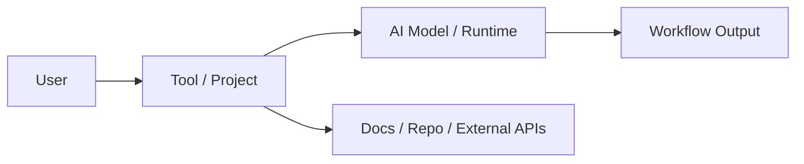

# affaan-m/everything-claude-code

## Metadata

- Source: https://github.com/affaan-m/everything-claude-code
- Source type: github_repo
- Signal score: 67.0
- Status: draft
- Confidence: medium
- Tags: ai, github, signal

## TL;DR

The agent harness performance optimization system. Skills, instincts, memory, security, and research-first development for Claude Code, Codex, Opencode, Cursor and beyond.

## Why It Matters

- TODO: Explain why this signal matters now.
- TODO: Describe the engineering or product shift behind it.
- TODO: Note whether this is worth hands-on follow-up.

## Quick Start

```bash
# TODO: Add install or clone commands
```

## Core Concepts

- TODO: Concept 1
- TODO: Concept 2
- TODO: Concept 3

## Architecture



## Evaluation Notes

| Dimension | Notes |
| --- | --- |
| Use case | TODO |
| Docs quality | TODO |
| Code quality | TODO |
| Activity | TODO |
| License | TODO |
| Risk | TODO |

## Hands-on Notes

- TODO: Record setup result.
- TODO: Record useful commands.
- TODO: Record blockers.

## Links

- Source: https://github.com/affaan-m/everything-claude-code

## Raw Signal Snapshot

```json
{"repo_id": 12, "full_name": "affaan-m/everything-claude-code", "url": "https://github.com/affaan-m/everything-claude-code", "description": "The agent harness performance optimization system. Skills, instincts, memory, security, and research-first development for Claude Code, Codex, Opencode, Cursor and beyond.", "language": "JavaScript", "license": "MIT", "latest_stars": 164528, "latest_forks": 25544, "latest_open_issues": 148, "stars_delta": 994, "forks_delta": 162, "score": 67, "reasons": ["stars_delta > 100: +15", "forks_delta > 0: +5", "stars > 10000: +10", "forks > 1000: +5", "has_license: +5", "has_language: +2", "ai_keyword_match: +15", "latest_commit within 14 days: +10"], "risks": []}
```
