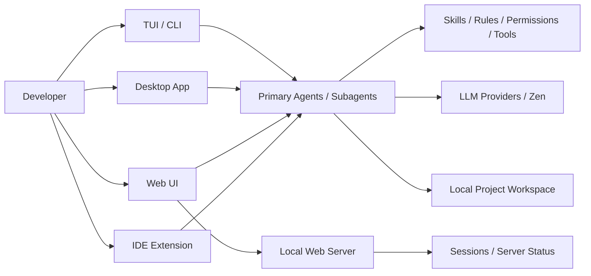

# anomalyco/opencode

## Metadata

- Source: https://github.com/anomalyco/opencode
- Source type: github_repo
- Signal score: 57.0
- Status: final
- Confidence: high
- Tags: ai, github, coding-agent, terminal, desktop, ide, web

## TL;DR

OpenCode 是一个开源 AI coding agent，既能在终端里运行，也提供桌面端、Web 和 IDE 集成。它当前的吸引力不只是“又一个 CLI agent”，而是把多入口形态、可配置 agent、skills、web 会话、分享机制和较完整文档体系做成了一条更工程化的产品线。

## Why It Matters

- 它明显在从“终端里的开源 coding agent”往“多形态 AI 开发工作台”演进：同一套能力覆盖 terminal、desktop、Web、IDE extension，而不是只做一个 CLI 壳。
- 它把 agent 化能力做成了可以配置和复用的工程接口，包括 primary agent、subagent、skills、permissions、custom tools、plugins，这对做团队级工作流很关键。
- 文档和发布节奏都比较成熟。官网 docs 已经覆盖安装、Web、IDE、agents、skills 等主题，官网 changelog 和 GitHub release 也在持续更新。
- 对我们这种关注 AI 工程应用的人来说，它的学习价值高于单纯“模型接线”：重点在 agent workflow、权限边界、技能组织、跨终端/浏览器/IDE 协同。
- 值得跟进。它不只是概念热度高，还是一个正在快速迭代、具备较强工程落地信号的项目。

## Quick Start

```bash
# Install script
curl -fsSL https://opencode.ai/install | bash

# Package manager
npm install -g opencode-ai

# Homebrew
brew install anomalyco/tap/opencode

# Run
opencode

# Initialize in an existing project
/init
```

## Core Concepts

- 多入口交互：OpenCode 不只是一套 TUI。官方文档明确支持 terminal、desktop、Web 和 IDE extension，这意味着它的核心体验目标是“同一 agent 能力，多入口使用”。
- Agent 模型：官方 docs 里把 agent 分成 primary agents 和 subagents。内置 primary agent 包括 `build` 和 `plan`；内置 subagent 包括 `general` 和 `explore`。其中 `plan` 默认限制写入和 bash，更适合分析和规划。
- Skills 机制：OpenCode 支持通过 `SKILL.md` 定义可复用行为，并会在项目或全局目录中自动发现这些技能。这个点和我们当前做知识库生成 skill 的思路高度相关。
- Web 工作方式：`opencode web` 会启动本地 Web 服务，在浏览器中提供会话管理、服务器状态查看和终端连接能力。
- IDE 集成：官方 docs 说明它支持 VS Code、Cursor 等 IDE；运行 `opencode` 后可自动安装扩展，并支持上下文共享和文件引用快捷键。
- Provider 配置：官方 Intro 文档说明，终端使用仍需要你配置模型 provider 的 API key；如果不想自己拼 provider，可走 OpenCode Zen 这条路径。

## Architecture



Inference: 上图是基于官方 docs 中的功能结构整理出来的学习视图，不是项目仓库里明确给出的内部实现图。

## Evaluation Notes

| Dimension | Notes |
| --- | --- |
| Use case | 适合把 OpenCode 作为开源 coding agent 平台来研究，重点学习 terminal agent、Web/IDE 接入、agent 权限、skills、项目级配置。 |
| Docs quality | 强。官网 docs 有 Intro、Web、IDE、Agents、Skills、Config、Providers 等专题，覆盖面已经超出“README 级说明”。 |
| Code quality | 暂未逐模块审代码，但仓库结构完整，包含 `packages/`、`specs/`、`sdks/`、`infra/` 等目录，工程化信号较强。 |
| Activity | 很高。GitHub 仓库约 148k stars、约 17k forks、11k+ commits；官网 changelog 和 GitHub releases 在 2026-04-23 前后仍有更新。 |
| License | MIT。 |
| Risk | 1) 仓库 open issues 很高，说明增长快但维护压力也大。2) Web 模式如果未设置 `OPENCODE_SERVER_PASSWORD`，官方明确提示只适合本地使用。3) Windows 路径上，官方 Web docs 明确更推荐在 WSL 下运行。4) Desktop 仍带 beta 信号。 |

## Hands-on Notes

- 尚未在本项目环境中实际安装和跑通，因此不记录伪造的“已验证结果”。
- 适合后续真实验证的最小路径：
  - CLI：安装后执行 `opencode`
  - 项目初始化：进入代码目录后执行 `/init`
  - Web：执行 `opencode web`
  - IDE：在 VS Code / Cursor 集成终端中运行 `opencode`
- 后续实操建议：
  - 验证 `plan` / `build` 两个 primary agent 的工作边界
  - 验证 project-local `SKILL.md` 是否能被稳定发现
  - 验证 Web 模式的局域网访问、CORS 和密码保护
  - 验证 IDE 扩展自动安装和文件引用快捷键体验

## Links

- Source: https://github.com/anomalyco/opencode
- Official site: https://opencode.ai/
- Docs: https://opencode.ai/docs
- Web docs: https://opencode.ai/docs/web/
- IDE docs: https://opencode.ai/docs/ide/
- Agents docs: https://opencode.ai/docs/agents/
- Skills docs: https://opencode.ai/docs/skills
- Changelog: https://opencode.ai/changelog
- Releases: https://github.com/anomalyco/opencode/releases

## Raw Signal Snapshot

```json
{"repo_id": 15, "full_name": "anomalyco/opencode", "url": "https://github.com/anomalyco/opencode", "description": "The open source coding agent.", "language": "TypeScript", "license": "MIT", "latest_stars": 147914, "latest_forks": 16904, "latest_open_issues": 6095, "stars_delta": 577, "forks_delta": 96, "score": 57, "reasons": ["stars_delta > 100: +15", "forks_delta > 0: +5", "stars > 10000: +10", "forks > 1000: +5", "has_license: +5", "has_language: +2", "ai_keyword_match: +15", "latest_commit within 14 days: +10"], "risks": ["very_high_open_issues: -10"]}
```
