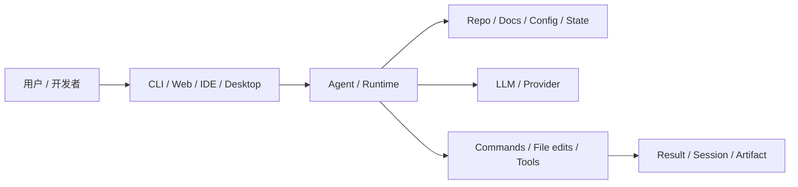
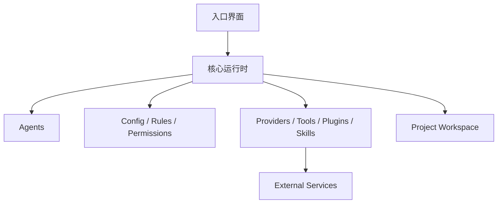
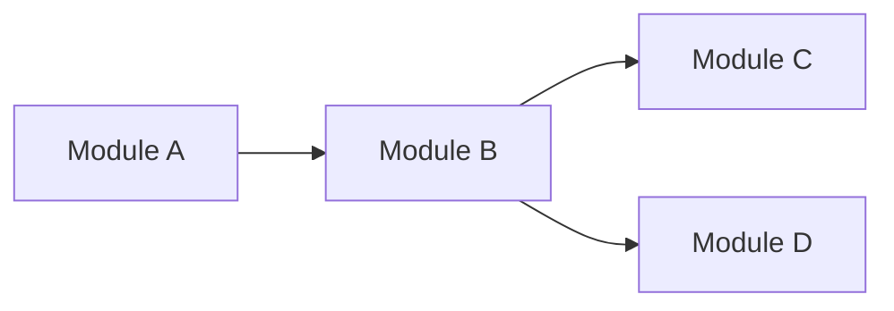

# anomalyco/opencode 深度项目知识档案

## 元数据
- Source: https://github.com/anomalyco/opencode
- Source type: github_repo
- Project type: ai_project
- Signal score: 57.0
- Status: draft
- Confidence: medium
- Depth level: deep_dossier
- Last reviewed at: 2026-04-24
- Tags: ai, github, deep-dossier

## 执行摘要

### TL;DR

The open source coding agent.

### 为什么这个项目值得学习

- TODO: 说明为什么这个项目现在值得关注。
- TODO: 说明它代表了 AI 工程、产品或开源生态中的什么趋势。
- TODO: 说明它更重要的是工具价值、工程模式价值，还是生态信号价值。

### 这篇文档最该记住什么

至少列出 3 条关键结论；复杂项目建议 4-6 条。

- TODO: 关键结论
- TODO: 关键结论
- TODO: 关键结论

## 项目定位

### 它在解决什么问题
TBD

### 它主要面向谁
TBD

### 它不是什么

- TODO: 澄清常见误解。
- TODO: 澄清它不应该和哪些相邻工具或项目混淆。

### 可对照项目

按需要补充多行，不要求只写 1 个。

| 项目 | 关系 | 关键差异 |
| --- | --- | --- |
| TODO | TODO | TODO |

## 学习路径

### 推荐阅读顺序

按阶段列出，不强制固定 4 步。简单项目可 3-4 步，复杂项目可 5-8 步。

1. TODO: 先读什么，建立整体心智
2. TODO: 再读什么，理解关键概念或模块
3. TODO: 再看哪些代码、配置或示例
4. TODO: 最后如何做实战验证

### 最小可用心智模型
TBD

## 核心概念

### 关键术语

按需要补充多行。

| 术语 | 在本项目中的含义 | 为什么重要 |
| --- | --- | --- |
| TODO | TODO | TODO |

### 核心概念解释

至少列出 3 个；复杂项目建议 5-8 个。  
每个概念都应说明：

- 它是什么
- 它在本项目里扮演什么角色
- 它和其他概念如何连接
- 为什么学习者必须理解它

#### 概念：TODO

TBD

#### 概念：TODO

TBD

#### 概念：TODO

TBD

## 用户工作流

### 典型端到端流程

按实际工作流拆解，不要求固定 4 步。

1. TODO
2. TODO
3. TODO
4. TODO

### 工作流图



### 工作流解释

- TODO: 用自然语言解释每个阶段在做什么。
- TODO: 解释用户意图从哪里进入系统。
- TODO: 解释上下文、模型和工具动作是怎么连接的。

## 架构总览

### 系统架构图



### 架构说明

TBD

### 为什么它会这样设计

- TODO: 解释可能的设计取舍。
- TODO: 把“源码明确给出的事实”和“推断”分开写清楚。

## 分层拆解

按实际架构拆层，建议 3-6 层。  
不要因为模板写了 4 层，就强行把项目压成 4 层。

### 第 N 层：TODO

TBD

### 第 N 层：TODO

TBD

### 第 N 层：TODO

TBD

## 关键模块

### 重要目录

按需要补充多行。

| Path | 作用 | 为什么重要 |
| --- | --- | --- |
| TODO | TODO | TODO |

### 重要配置文件

按需要补充多行。

| File | 作用 | 备注 |
| --- | --- | --- |
| TODO | TODO | TODO |

### 关键运行概念

- TODO

## 代码导览

### 可能的入口点

按需要补充多行。

| Entry point | 作用 | Confidence |
| --- | --- | --- |
| TODO | TODO | TODO |

### 模块关系图



### 阅读代码时的说明

- TODO: 如果第一次读代码，建议从哪里开始。
- TODO: 哪些区域是核心，哪些区域是外围。
- TODO: 哪些部分是公共能力 / 用户可见行为，哪些更像内部实现。

## 配置与可扩展性

### 配置模型

TBD

### 扩展点

按项目实际增删，不强制只有这 5 类。

- TODO: Skills
- TODO: Plugins
- TODO: Tools
- TODO: Agents
- TODO: Rules / Permissions

### 安全与权限边界

TBD

## 支持的运行形态

按项目实际增删。  
如果某种形态不存在，就明确写“无”或删掉该小节；如果有额外形态，如 API / SDK / Slack / MCP / Cloud，也应补充。

### CLI / TUI

TBD

### Web

TBD

### IDE

TBD

### Desktop

TBD

## 实战使用

### Quick Start

```bash
# TODO: 这里只放有来源支持的命令
```

### 最真实的第一批使用场景

至少列出 2 个。复杂项目可写 3-5 个。

1. TODO
2. TODO

### 推荐实战练习

至少列出 2 个；复杂项目建议 3-5 个。  
不要求机械分成“入门 / 进阶 / 深入”，更重要的是练习是否真实、可执行。

1. TODO: 实战练习
2. TODO: 实战练习
3. TODO: 实战练习

### 采用建议

- TODO: 什么样的个人或团队最容易上手
- TODO: 实际接入时最大的摩擦点是什么
- TODO: 哪些前置条件最容易被忽略

## 优势、弱点与风险

### 优势

- TODO

### 弱点

- TODO

### 风险与注意事项

- TODO

### 最适合放在什么类场景

TBD

### 最不适合放在什么类场景

TBD

## 评估结论

| 维度 | 说明 |
| --- | --- |
| Use case fit | TODO |
| Docs quality | TODO |
| Code quality | TODO |
| Activity | TODO |
| License | TODO |
| Community health | TODO |
| Learning value | TODO |
| Practical adoption difficulty | TODO |
| Risk | TODO |

## 对比结论

### 与同类工具相比

按需要补充多行，只比较真正有意义的对象。

| Tool / Project | 更强的地方 | 更弱的地方 | 备注 |
| --- | --- | --- | --- |
| TODO | TODO | TODO | TODO |

### 战略判断

TBD

## 学习建议

### 最应该先学什么

- TODO

### 初期可以先忽略什么

- TODO

### 后续应该回来看看什么

- TODO

## 动手记录

- TODO: 如果真的跑过，就记录真实 setup 结果。
- TODO: 记录环境信息。
- TODO: 记录卡点和 workaround。
- TODO: 记录哪些结论还没有通过实测验证。

## 未解决问题

- TODO

## Links

- Repo:
- Docs:
- Release notes / changelog:
- Examples:
- Related blog / paper / announcement:

## 信源与置信度说明

- TODO: 哪些部分是主信源直接支持的。
- TODO: 哪些部分是根据代码 / 文档合理推断的。
- TODO: 哪些部分还需要后续代码级验证。

## Raw Signal Snapshot

```json
{"repo_id": 15, "full_name": "anomalyco/opencode", "url": "https://github.com/anomalyco/opencode", "description": "The open source coding agent.", "language": "TypeScript", "license": "MIT", "latest_stars": 147914, "latest_forks": 16904, "latest_open_issues": 6095, "stars_delta": 577, "forks_delta": 96, "score": 57, "reasons": ["stars_delta > 100: +15", "forks_delta > 0: +5", "stars > 10000: +10", "forks > 1000: +5", "has_license: +5", "has_language: +2", "ai_keyword_match: +15", "latest_commit within 14 days: +10"], "risks": ["very_high_open_issues: -10"]}
```
