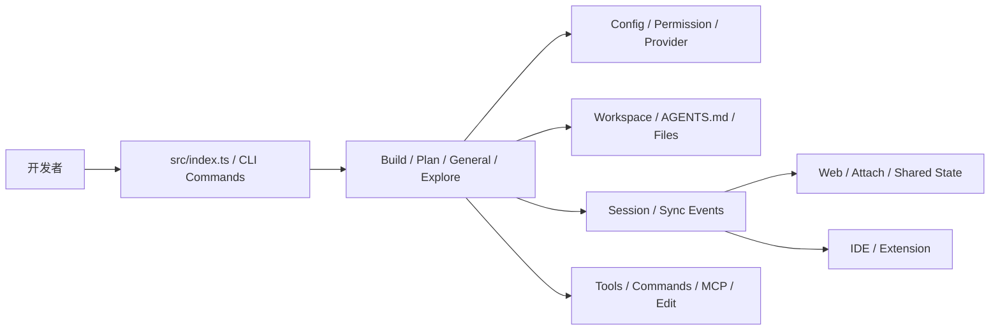
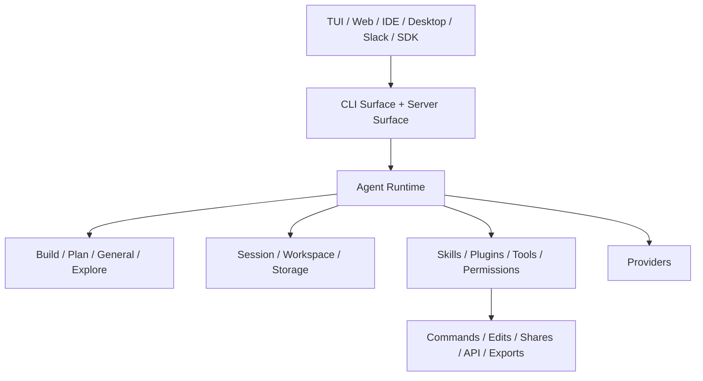
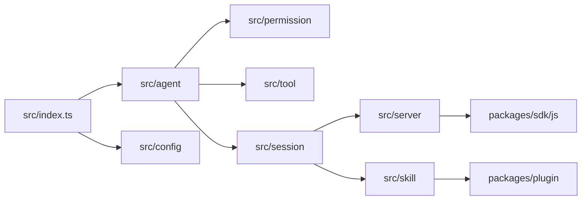

# anomalyco/opencode 深度项目知识档案

## 元数据
- Source: https://github.com/anomalyco/opencode
- Source type: github_repo
- Project type: ai_coding_agent_platform
- Signal score: 57
- Status: final
- Confidence: high for product/doc facts; medium-high for source-level architectural reconstruction
- Depth level: deep_dossier
- Last reviewed at: 2026-04-24
- Tags: ai, github, coding-agent, terminal, web, ide, desktop, sdk, slack, skills, source-level

## 执行摘要

### TL;DR

OpenCode 是一个开源 AI coding agent 平台。它表面上看是“在终端里运行的编码代理”，但从官方文档、monorepo 结构、CLI 入口、server/session 代码、skills/plugin/sdk 包组织来看，它更准确的定位是：

```text
一个以本地工作区为中心、以 agent runtime 为核心、向 TUI / Web / IDE / Desktop / SDK / Slack 多入口扩展的开发工作台
```

如果只把它看成“另一个会改代码的 CLI”，会低估它真正值得学的地方：权限模型、agent mode、session 状态、skills 发现机制、config 合并链路、server 路由组织，以及如何把同一能力内核投射到不同客户端。

### 为什么这个项目值得学习

- 它不仅有产品文档，而且源码结构清晰到足以支持源码级补深。
- 根 `package.json` 明确显示它是一个 Bun + Turbo 的 monorepo，工作区覆盖 `packages/*`、`packages/console/*`、`packages/sdk/js`、`packages/slack`，说明它从一开始就不是单包 CLI。
- `packages/opencode/src/index.ts` 暴露出很大的命令面：`run`、`generate`、`providers`、`agent`、`web`、`serve`、`session`、`plugin`、`mcp`、`github`、`pr`、`db`、`attach` 等，这说明它的能力面已经超出“聊天 + 改文件”。
- `packages/opencode/package.json` 同时依赖大量 provider SDK、`@modelcontextprotocol/sdk`、`@agentclientprotocol/sdk`、`hono`、`drizzle-orm`、`tree-sitter`、`node-pty`、`opentelemetry` 等，这本身就在说明：它是 runtime 平台，而不是一个薄壳。

### 这篇文档最该记住什么

- OpenCode 的核心是 **runtime**，不是 UI。
- 它的 agent mode、permissions、session、workspace、skills 是一套联动机制。
- Web/IDE/Desktop/Slack 不是外挂，而是共享内核的不同入口。
- 它的源码结构已经能支持“产品面 -> 机制面 -> 源码面”的系统学习。
- 这类项目的学习重点不是模型效果，而是“AI 工程能力如何被组织成平台”。

## 项目定位

### 它在解决什么问题

OpenCode 想解决的不是“如何做一个聊天式编程助手”，而是“如何让 AI agent 在真实项目工作区中，以可治理、可配置、可跨入口的方式工作”。

它同时处理了四类问题：

1. **工作区问题**：agent 如何稳定工作在本地 repo，而不是漂浮在抽象对话里。
2. **权限问题**：分析和执行能否区分，工具访问能否细粒度控制。
3. **状态问题**：session、workspace、共享状态、fork、restore 如何成立。
4. **入口问题**：同一能力如何自然延展到 TUI、Web、IDE、Desktop、Slack、SDK。

### 它主要面向谁

- 重度终端开发者
- 想在真实代码仓库里使用 AI agent 的工程团队
- 想研究 agent runtime / permissions / sessions / skills 的 AI 工程学习者
- 想把本地工作流沉淀成 repo-local 能力的人

### 它不是什么

- 它不是单纯聊天应用。
- 它不是只包一层 TUI 的 demo。
- 它不是只依赖某个特定模型 API 的工具。
- 它也不是“只有 docs 很热但源码没什么东西”的展示仓库。

### 可对照项目

| 项目 | 关系 | 关键差异 |
| --- | --- | --- |
| Claude Code | 最接近的认知参照物 | OpenCode 更公开地展示 provider 无锁定、client/server、skills、plugin/sdk 扩展面 |
| Cursor | 编辑器内 AI 编程体验 | Cursor 更像 IDE-first 产品；OpenCode 更明显是 runtime-first、多入口 |
| Codex CLI / Codex Agent | 相邻 agent 工作流 | OpenCode 更公开地把 session、server、skills、plugin 等体系做成产品表面 |
| Cline / Roo Code | 相邻开源生态 | OpenCode 的 monorepo 平台感更强，入口更丰富 |

## 学习路径

### 推荐阅读顺序

1. 先看 Intro + README，建立产品心智。
2. 再看 Agents 文档，理解 mode 与权限。
3. 再看 Skills 文档，理解 repo-local 能力沉淀。
4. 再看 Web / IDE 文档，理解多入口。
5. 然后看根 `package.json` 和 `packages/opencode/package.json`，建立源码地图。
6. 再读 `packages/opencode/src/index.ts`、`src/agent/agent.ts`、`src/config/config.ts`、`src/server/server.ts`、`src/session/session.ts`、`src/skill/discovery.ts`。

### 最小可用心智模型

可以先把 OpenCode 理解成：

1. `src/index.ts` 组织的 CLI / command surface
2. `agent + permission + config + provider` 组成的运行时骨架
3. `session + server + workspace` 组成的状态与多入口骨架
4. `skill + plugin + sdk + slack` 组成的扩展与生态骨架

## 核心概念

### 关键术语

| 术语 | 在本项目中的含义 | 为什么重要 |
| --- | --- | --- |
| Build | 默认主 agent，完整工具访问 | 代表执行型开发模式 |
| Plan | 受限主 agent，file edits 与 bash 默认 `ask` | 代表分析与计划模式 |
| General | 通用子 agent | 承担多步任务与并行执行 |
| Explore | 偏只读探索的子 agent | 适合代码搜索、目录理解与快速问答 |
| Permission | 基于规则集的 allow / deny / ask 机制 | 是 agent 安全边界的核心 |
| Skill | 通过 `SKILL.md` 发现和加载的本地能力模块 | 是 repo-local 工作流沉淀的关键 |
| Session | 持续会话对象，可 create / fork / archive / update | 是多轮协作与多入口共享状态的核心 |
| Workspace | 当前项目工作区 | agent 真正工作的对象 |
| Provider | 模型接入层 | 表明模型是运行依赖，不是产品本体 |
| Plugin | 更程序化的扩展接口 | 说明扩展体系不止技能文本 |

### 核心概念解释

#### 概念：Agent mode

`src/agent/agent.ts` 直接定义了内建 agent：

- `build`
- `plan`
- `general`
- `explore`

而且不是只定义名字，还定义了：

- `description`
- `mode`（primary / subagent）
- `permission`
- 可选 `model`
- `options`

这说明 agent 在 OpenCode 中是“可配置工作模式”，不是抽象的人格标签。

#### 概念：Permission

`src/permission/evaluate.ts` 很短，但很关键。它定义了一条非常清晰的规则：

- 权限动作只有 `allow / deny / ask`
- 规则通过 wildcard 匹配
- 使用 `findLast` 选取最后匹配到的规则
- 默认兜底是 `ask`

这意味着权限系统是：

```text
规则表驱动 + 模式可覆盖 + 默认保守
```

这比“让模型自己小心点”成熟得多。

#### 概念：Build / Plan 的产品含义

在 `src/agent/agent.ts` 中：

- `build` 继承默认权限，并显式允许 `question` 与 `plan_enter`
- `plan` 也允许 `question`，但其 `edit` 默认 deny，只对计划文档路径放开
- `plan` 允许 `plan_exit`

这说明 Plan 不是一句“请先规划”，而是代码层落地的权限型模式。

#### 概念：Skills

除了文档层定义，源码里也能看到 skills 已经被认真当成系统能力：

- `src/skill/discovery.ts` 定义了 `Discovery.pull(url)`，会去拉取远端 `index.json`
- 要求每个 skill entry 必须包含 `SKILL.md`
- 下载后缓存到 `Global.Path.cache/skills`

这说明 OpenCode 不只是支持本地 skills，也在往“技能分发 / 拉取”方向演进。

#### 概念：Session

`src/session/session.ts` 不是一个小对象工具文件，而是一整块状态核心。源码里能直接看到：

- `create`
- `fork`
- `setTitle`
- `setArchived`
- `setPermission`
- `updateMessage`
- `updatePart`

并且这些更新通过 `SyncEvent.run(...)` 广播，说明 session 不是单机变量，而是系统级状态。

#### 概念：Client / Server

`src/server/server.ts` 使用 Hono 组装 server：

- `AuthMiddleware`
- `LoggerMiddleware`
- `CompressionMiddleware`
- `CorsMiddleware`
- `GlobalRoutes`
- `WorkspaceRoutes`
- `InstanceRoutes`

并且支持：

- `OPENCODE_WORKSPACE_ID`
- `OPENCODE_EXPERIMENTAL_HTTPAPI`
- WebSocket 升级
- mDNS 发布

这说明“client/server architecture”在源码层是真实存在的，不只是 README 的宣传词。

#### 概念：Provider-agnostic

`packages/opencode/package.json` 直接列出了大量 provider 依赖：

- `@ai-sdk/openai`
- `@ai-sdk/anthropic`
- `@ai-sdk/google`
- `@ai-sdk/google-vertex`
- `@ai-sdk/groq`
- `@ai-sdk/mistral`
- `@ai-sdk/cohere`
- `@ai-sdk/xai`
- `@ai-sdk/azure`
- `@ai-sdk/amazon-bedrock`
- `@openrouter/ai-sdk-provider`
- `ai-gateway-provider`
- `gitlab-ai-provider`
- `venice-ai-sdk-provider`

这说明 provider 无锁定不是口号，而是写进依赖面的设计。

## 用户工作流

### 典型端到端流程

1. 用户进入项目目录并运行 `opencode`。
2. `src/index.ts` 解析命令和参数，初始化日志、数据库迁移与运行元信息。
3. agent runtime 读取 config、skills、permissions、workspace、provider。
4. 用户选择或进入 `build` / `plan`。
5. 如有必要，任务分派给 `general` 或 `explore`。
6. 工具调用、文件编辑、命令执行与会话状态更新写入 session。
7. 同一能力可被 Web、IDE、Desktop 或其他入口复用。

### 工作流图



### 工作流解释

- CLI 入口不是单一命令，而是一整个命令面。
- agent mode 决定权限与能力边界。
- config 与 permission 会在实际动作前发生作用，而不是事后补救。
- session 负责把动作与状态串起来，使多入口成为可能。

## 架构总览

### 系统架构图



### 架构说明

通过源码看，OpenCode 的骨架大致是：

- **入口面**：CLI command、Web server、IDE、Desktop、Slack、SDK
- **运行时面**：agent / permission / config / provider / tool
- **状态面**：session / workspace / storage / sync event
- **扩展面**：skill / plugin / MCP / SDK

特别值得注意的是，`packages/opencode/package.json` 里的 `imports` 定义了：

- `#db`
- `#pty`
- `#hono`

分别针对 `bun` / `node` 切到不同实现文件。这个细节很重要，它说明 OpenCode 在 runtime 适配层已经认真区分环境，而不是只写死在一个运行时里。

### 为什么它会这样设计

- 如果没有明确的 runtime 层，就很难支撑 build/plan 这类 agent mode。
- 如果没有明确的 state 层，就很难支撑 session fork、attach、Web 共享与状态恢复。
- 如果没有明确的适配层，就很难同时支持 Bun / Node、server / TUI、Desktop / IDE。

Inference: 这里的总体架构图是根据代码组织和命令面重建的系统理解图，不是仓库内原生给出的官方架构图。

## 分层拆解

### 第 1 层：命令与入口层

`src/index.ts` 直接暴露出大量 command：

- `RunCommand`
- `GenerateCommand`
- `ProvidersCommand`
- `AgentCommand`
- `ServeCommand`
- `WebCommand`
- `ModelsCommand`
- `StatsCommand`
- `ExportCommand`
- `ImportCommand`
- `GithubCommand`
- `PrCommand`
- `SessionCommand`
- `PluginCommand`
- `DbCommand`
- `AttachCommand`
- `TuiThreadCommand`
- `McpCommand`
- `AcpCommand`

这说明 OpenCode 的入口面已经非常厚，不是单一 chat command。

### 第 2 层：配置与权限层

`src/config/config.ts` 负责读取和合并配置。源码里能确认：

- 全局配置候选包括 `opencode.jsonc`、`opencode.json`、`config.json`
- 会加载 `Global.Path.config` 下配置
- 支持 `OPENCODE_CONFIG`
- 支持 `OPENCODE_CONFIG_DIR`
- 会对 `.opencode` 目录中的 `opencode.json` / `opencode.jsonc` 做合并
- 若缺失 `$schema`，还会补成 `https://opencode.ai/config.json`

这一层说明 OpenCode 对“本地项目配置 + 全局配置 + 外部指定配置”的链路处理得很工程化。

### 第 3 层：Agent 与工作模式层

`src/agent/agent.ts` 把 build / plan / general / explore 作为内建 agent 定义，并把权限、描述、mode、模型选项聚在一起。

这里是真正的“产品语义层”：用户看到的是 agent 名称，系统执行的是规则化行为。

### 第 4 层：状态与会话层

`src/session/session.ts` 说明 session 是系统主干之一：

- 支持 create / fork
- 支持 title / archive / permission 更新
- 支持 message / part 更新
- 通过 SyncEvent 广播变化

这意味着多入口并不是各玩各的，而是共享状态机制。

### 第 5 层：服务与扩展层

`src/server/server.ts` 说明 server 面有完整 middleware / routes / workspace routing / experimental HTTP API 支撑；  
`src/skill/discovery.ts` 说明 skills 可远端拉取；  
`packages/plugin/src/index.ts` 则说明 plugin hooks 能拦截：

- `chat.message`
- `chat.params`
- `chat.headers`
- `permission.ask`
- `command.execute.before`
- `tool.execute.before`
- `tool.execute.after`
- `shell.env`
- 若干 experimental chat transforms

这层说明 OpenCode 的扩展体系比“读一个 SKILL.md”更广。

## 关键模块

### 重要目录

| Path | 作用 | 为什么重要 |
| --- | --- | --- |
| `packages/opencode` | 核心 runtime 与 CLI 产品包 | 代码级补深的主战场 |
| `packages/opencode/src/agent` | agent 定义 | 直接决定 build/plan/general/explore 的角色 |
| `packages/opencode/src/config` | 配置解析与合并 | 决定本地/全局/project 配置链 |
| `packages/opencode/src/permission` | 权限规则评估 | 决定 allow/deny/ask 机制 |
| `packages/opencode/src/session` | 会话状态与同步 | 决定多轮、多入口协作 |
| `packages/opencode/src/server` | Web/server 面 | 决定浏览器端、workspace route、HTTP API |
| `packages/opencode/src/skill` | 技能发现与拉取 | 决定本地/远端 skill 能力 |
| `packages/opencode/src/tool` | 工具注册与导出 | 决定可调用工具能力面 |
| `packages/plugin` | plugin API | 说明扩展接口是正式产品面 |
| `packages/sdk/js` | JS SDK | 说明其能力在向程序化接入开放 |
| `packages/slack` | Slack 入口 | 说明它不止单机端 |

### 重要配置文件

| File | 作用 | 备注 |
| --- | --- | --- |
| `package.json` | 根工作区与脚本 | 暴露 monorepo 结构与开发任务 |
| `packages/opencode/package.json` | 核心包脚本、bin、imports、依赖 | 对理解 runtime 组成很关键 |
| `turbo.json` | monorepo 编排 | 说明多包协作 |
| `sst.config.ts` | 服务/基础设施相关 | 指向服务端与部署层 |
| `bunfig.toml` | Bun 配置 | 说明 Bun 是核心运行时之一 |

### 关键运行概念

- `Global.Path.config`
- `.opencode/opencode.json`
- `SyncEvent`
- `WorkspaceID`
- `InstanceMiddleware`
- `Discovery.pull`
- `Permission.merge`
- `#db / #pty / #hono`

## 代码导览

### 可能的入口点

| Entry point | 作用 | Confidence |
| --- | --- | --- |
| `packages/opencode/src/index.ts` | CLI 主入口与命令注册 | high |
| `packages/opencode/src/agent/agent.ts` | 内建 agent 与默认权限 | high |
| `packages/opencode/src/config/config.ts` | 配置加载与合并逻辑 | high |
| `packages/opencode/src/server/server.ts` | Web/server 入口 | high |
| `packages/opencode/src/session/session.ts` | session 状态核心 | high |
| `packages/opencode/src/skill/discovery.ts` | 远端技能发现与缓存 | high |
| `packages/plugin/src/index.ts` | plugin hook 接口 | high |
| `packages/sdk/js/src/index.ts` | SDK 入口 | medium |

### 模块关系图



### 阅读代码时的说明

- 第一轮先读 `src/index.ts`，看系统表面能力。
- 第二轮读 `agent + permission + config`，理解行为边界。
- 第三轮读 `session + server`，理解状态和多入口。
- 第四轮读 `skill + plugin + sdk`，理解扩展生态。

## 配置与可扩展性

### 配置模型

源码显示，配置不是单点文件，而是一条合并链：

1. 全局 config 目录
2. `opencode.json` / `opencode.jsonc`
3. legacy config
4. `OPENCODE_CONFIG`
5. `OPENCODE_CONFIG_DIR`
6. `.opencode` 目录中的项目配置
7. managed config / remote account config

这说明 OpenCode 对配置来源的现实复杂度有充分预期。

### 扩展点

- Skills：本地 `SKILL.md` + 远端 `index.json` 拉取
- Plugins：hook-based 扩展点
- Tools：通过工具注册表导出
- Agents：通过 config 与内建 agent 共同组织
- Providers：大量 provider SDK 支撑
- MCP / ACP：从命令与依赖面都可见
- SDK：程序化接入

### 安全与权限边界

源码级证据已经很明确：

- 权限只有 `allow / deny / ask`
- 默认匹配不到时回到 `ask`
- `plan` 对 edit 默认 deny，只对计划文档路径放开
- `explore` 基本是只读/搜索导向能力
- server 启动面强制经过 `AuthMiddleware`

这说明 OpenCode 的权限不是“补充说明”，而是核心设计。

## 支持的运行形态

### CLI / TUI

最成熟的入口，`src/index.ts` 就是证据。

### Web

`src/server/server.ts` 直接以 Hono 组织 server，包含：

- middleware 链
- `/global`
- workspace 路由
- instance 路由
- experimental HTTP API
- WebSocket 升级
- mDNS 发布

### IDE

从 docs 明确可知 IDE 集成存在；源码层则可见 `src/ide`、`src/lsp`、`config/lsp.ts` 等目录与配置文件，说明这不是表层 feature。

### Desktop

仓库存在 `packages/desktop-electron`，说明桌面端是正式入口之一。

### SDK / API

`packages/sdk/js/package.json` 直接导出：

- `./client`
- `./server`
- `./v2`
- `./v2/client`
- `./v2/server`

这说明 SDK 不只是薄薄一层类型文件，而是准备支持多形态调用。

### Slack

`packages/slack` 说明其入口已经向团队协作延展。

## 实战使用

### Quick Start

```bash
# 安装
curl -fsSL https://opencode.ai/install | bash

# 进入项目目录
cd /path/to/project

# 启动
opencode

# 初始化项目上下文
/init

# 启动 Web
opencode web
```

### 最真实的第一批使用场景

1. 用 `plan` 理解一个陌生仓库并生成执行计划。
2. 用 `build` 在真实工作区里执行修改。
3. 为 repo 增加 local skill，沉淀团队动作。
4. 用 Web 共享 session 与状态。
5. 将某些能力程序化接入 SDK 或 Slack thread。

### 推荐实战练习

1. 只用 `plan` 跑一次代码理解任务，观察 ask/deny 行为。
2. 自定义一个 `opencode.json`，覆盖 agent permission，验证规则合并。
3. 写一个 repo-local `SKILL.md`，再对比本地 skill 与远端 discovery 思路。
4. 启动 `opencode web`，观察 session 与 workspace 路由行为。
5. 读 `plugin` hook，设计一个最小拦截型插件。

### 采用建议

- 最适合：愿意理解工作区、权限、provider、skills 的工程团队。
- 其次适合：想研究 agent 平台化的人。
- 不适合：只想用一个最轻量、最少配置的聊天式代码助手的人。

## 优势、弱点与风险

### 优势

- 产品文档与源码结构都足够强，支持系统学习。
- 运行时与权限模型清楚，不是靠提示词硬控。
- session / server / skill / plugin / sdk 这些长期问题都已进入代码层。
- provider 无锁定且接入面广。

### 弱点

- 项目复杂度高，阅读门槛不低。
- 有些内部实现仍然需要更细读源码才能完全确认。
- 多入口、多扩展面意味着认知面广，初学者容易抓不住主线。

### 风险与注意事项

- issue 数量高，说明增长快也说明维护压力大。
- server / web / network / auth 相关配置如果误用，风险真实存在。
- Desktop 与某些高级形态仍可能处于更快迭代阶段。

### 最适合放在什么类场景

- AI coding 平台研究
- 本地开发工作流升级
- repo-local skills 与 agent 规则体系建设
- 学习多入口共享 runtime 的产品设计

### 最不适合放在什么类场景

- 只想零配置开箱即用的人
- 不愿碰终端、provider、config 的团队
- 不允许 agent 接触工作区与命令执行的高限制环境

## 评估结论

| 维度 | 说明 |
| --- | --- |
| Use case fit | 很强，尤其适合学习 AI coding runtime 与平台化 |
| Docs quality | 很强 |
| Code quality | 从组织与关键模块暴露看很强，但仍需继续细读核心实现 |
| Activity | 很高 |
| License | MIT |
| Community health | 热度高但 issue 压力大 |
| Learning value | 极高 |
| Practical adoption difficulty | 中等偏上 |
| Risk | 中等 |

## 对比结论

### 与同类工具相比

| Tool / Project | 更强的地方 | 更弱的地方 | 备注 |
| --- | --- | --- | --- |
| Claude Code | 开源、provider 无锁定、能力内核更公开 | 默认产品心智不如 Claude 品牌直接 | 更适合研究系统骨架 |
| Cursor | 多入口与终端中心更明显 | IDE 内即开即用体验未必更轻 | 关注点不同 |
| Cline / Roo Code | plugin / sdk / session / server 面更强 | 理解门槛更高 | 更像平台，不只是插件 |

### 战略判断

OpenCode 已经不是“一个热项目”，而是一套值得拆开研究的 AI 开发平台。  
如果你要学习 AI 工程的下一层，不该只学它怎么调用模型，而应该学它怎么把：

- command surface
- runtime
- permission
- config
- session
- server
- skills
- plugins
- sdk

组织成一套长期可演化的系统。

## 学习建议

### 最应该先学什么

- `src/index.ts`
- `src/agent/agent.ts`
- `src/permission/evaluate.ts`
- `src/config/config.ts`
- `src/session/session.ts`
- `src/server/server.ts`

### 初期可以先忽略什么

- 某些更边缘的 UI 细节
- 更细碎的 provider 适配实现
- 桌面端个别 beta 修复类细节

### 后续应该回来看看什么

- `src/tool/registry` 与具体工具实现
- `src/provider/provider.ts`
- `src/storage`
- `packages/plugin/src/tool.ts`
- `packages/sdk/js/src/*`

## 动手记录

- TODO: 尚未在本地真实安装并跑通源码级验证流程。
- TODO: 尚未亲测 `opencode.json` 配置覆盖顺序。
- TODO: 尚未亲测远端 skill discovery 拉取。
- TODO: 尚未亲测 session fork / attach / restore 的完整链路。

## 未解决问题

- `src/storage` 与 `session.sql.ts` 的持久化细节还有哪些边界？
- `src/tool/registry` 里工具注册表如何与 permissions 精确对接？
- `plugin` hook 与 `skill` 的执行边界在源码里具体如何分工？
- Web / Desktop / IDE 三者共享 UI 和共享 runtime 的比例各有多大？

## Links

- Repo: https://github.com/anomalyco/opencode
- Root README: https://raw.githubusercontent.com/anomalyco/opencode/dev/README.md
- Docs: https://opencode.ai/docs
- Agents: https://opencode.ai/docs/agents/
- Skills: https://opencode.ai/docs/skills
- Web: https://opencode.ai/docs/web/
- IDE: https://opencode.ai/docs/ide/
- Changelog: https://opencode.ai/changelog
- Releases: https://github.com/anomalyco/opencode/releases
- Root package.json: https://raw.githubusercontent.com/anomalyco/opencode/dev/package.json
- Core package.json: https://raw.githubusercontent.com/anomalyco/opencode/dev/packages/opencode/package.json
- CLI entry: https://raw.githubusercontent.com/anomalyco/opencode/dev/packages/opencode/src/index.ts
- Agent definition: https://raw.githubusercontent.com/anomalyco/opencode/dev/packages/opencode/src/agent/agent.ts
- Session core: https://raw.githubusercontent.com/anomalyco/opencode/dev/packages/opencode/src/session/session.ts
- Server core: https://raw.githubusercontent.com/anomalyco/opencode/dev/packages/opencode/src/server/server.ts
- Skill discovery: https://raw.githubusercontent.com/anomalyco/opencode/dev/packages/opencode/src/skill/discovery.ts
- Plugin package: https://raw.githubusercontent.com/anomalyco/opencode/dev/packages/plugin/package.json
- Plugin API: https://raw.githubusercontent.com/anomalyco/opencode/dev/packages/plugin/src/index.ts
- SDK package: https://raw.githubusercontent.com/anomalyco/opencode/dev/packages/sdk/js/package.json
- Slack integration README: https://raw.githubusercontent.com/anomalyco/opencode/dev/packages/slack/README.md

## 信源与置信度说明

- 直接由文档与 README 支持的部分：
  - 安装方式、Web、IDE、Desktop、Skills、Agents、Provider 无锁定
- 直接由源码支持的部分：
  - CLI 命令面
  - build / plan / general / explore 的默认定义与权限差异
  - allow / deny / ask 权限评估
  - config 读取与合并链路
  - session 的 create / fork / update / archive / permission 更新
  - server 的 middleware、workspace route、HTTP API、WebSocket 组织
  - 远端 skill discovery 拉取和缓存
  - plugin hooks 的存在与能力范围
  - SDK 的导出面
- 仍带推断成分的部分：
  - 更精确的 runtime 内部模块边界
  - 各客户端共享代码比例
  - 某些更深层的 persistence / provider / tool 调度路径
- 本轮源码级分析适用性：
  - **适用且价值高**
  - 因为 OpenCode 的核心学习价值确实体现在 runtime、permissions、session、server、skill/plugin 这些代码层组织上

## Raw Signal Snapshot

```json
{
  "repo_id": 15,
  "full_name": "anomalyco/opencode",
  "url": "https://github.com/anomalyco/opencode",
  "description": "The open source coding agent.",
  "language": "TypeScript",
  "license": "MIT",
  "latest_stars": 147914,
  "latest_forks": 16904,
  "latest_open_issues": 6095,
  "stars_delta": 577,
  "forks_delta": 96,
  "score": 57,
  "reasons": [
    "stars_delta > 100: +15",
    "forks_delta > 0: +5",
    "stars > 10000: +10",
    "forks > 1000: +5",
    "has_license: +5",
    "has_language: +2",
    "ai_keyword_match: +15",
    "latest_commit within 14 days: +10"
  ],
  "risks": [
    "very_high_open_issues: -10"
  ]
}
```
