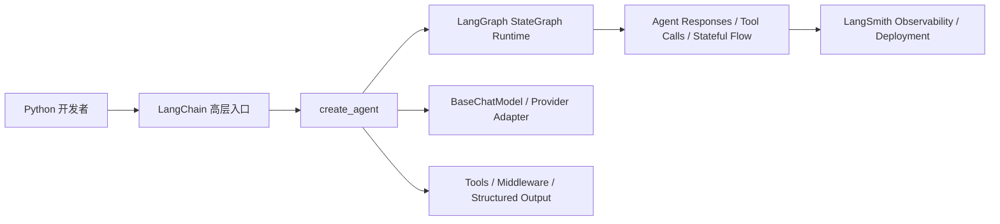
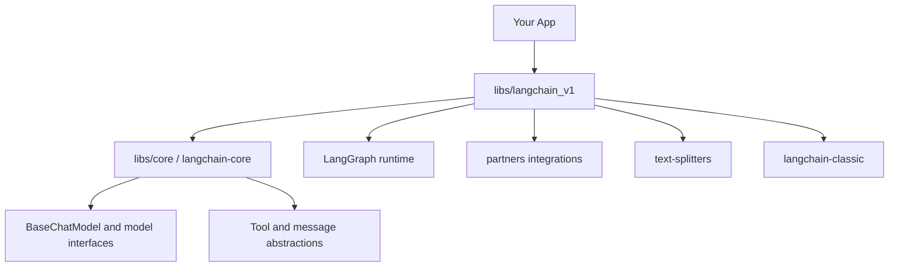
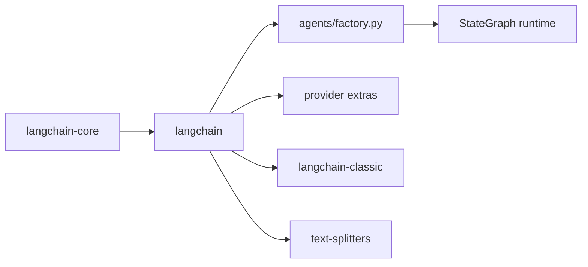

# langchain-ai/langchain 深度项目知识档案

## 元数据
- Source: https://github.com/langchain-ai/langchain
- Source type: github_repo
- Project type: ai_agent_framework
- Signal score: 67.0
- Status: final
- Confidence: high for product/package facts; medium-high for source-level architecture reconstruction
- Depth level: deep_dossier
- Last reviewed at: 2026-04-24
- Tags: ai, github, deep-dossier, python, agents, langgraph, framework

## 执行摘要

### TL;DR

LangChain 现在更准确的定位是“面向 Python 生态的 agent engineering 平台入口层”，而不是早期心智里的“把 prompt 和链条串起来的工具包”。从官网、README、monorepo 结构和核心源码入口看，它当前强调的是：

- 用统一模型接口和工具接口加速 AI 应用开发
- 提供预构建 agent 架构
- 把真正的 agent runtime 建在 LangGraph 之上
- 用 `langchain-core`、`langchain`、`langchain-classic`、`partners`、`text-splitters` 等包拆分职责

如果你现在学习 LangChain，不能只停留在“它能调 LLM”。更重要的是理解它如何把模型抽象、agent 创建、工具调用、生态集成和版本拆分组织成一套长期可演进的框架体系。

### 为什么这个项目值得学习

- 它依然是 Python AI 应用开发里最强的“统一抽象入口”之一，尤其适合学习标准模型接口、工具调用、agent 组装和生态集成。
- 它的公开定位已经很明确：LangChain 负责“快速构建 agents 和 applications”，而更底层、更可控的 orchestration 则由 LangGraph 承担。这种分层非常值得学。
- 它的 monorepo 结构本身就体现了一个成熟框架如何拆层：core 抽象层、主框架层、classic 兼容层、provider partners、text splitters、standard tests。
- 从源码看，它不是“简单地包一层 provider SDK”，而是把 agent 创建、state graph、middleware、structured output、模型抽象等机制都落进了代码骨架。

### 这篇文档最该记住什么

- LangChain 现在的主心智应该是“agent engineering platform”，不是旧时代的“chains 库”。
- `langchain-core` 是抽象地基，`langchain` 是上层易用入口，`langchain-classic` 是兼容旧能力的保留层。
- `create_agent` 的实现直接建立在 LangGraph 的 `StateGraph` 上，这说明 LangChain 的 agent 不是玩具循环，而是图驱动 runtime。
- LangChain 的价值很大一部分在“统一接口 + 大量集成 + 预构建 agent 架构”，而不是某一个单点算法。

## 项目定位

### 它在解决什么问题

LangChain 想解决的是：当开发者要做一个 LLM/agent 应用时，不希望每次都从 provider SDK、消息格式、工具封装、状态循环、结构化输出、streaming 等底层细节重新搭积木。

它提供的不是单一“最佳实践”，而是一组统一抽象与高层入口，让开发者能：

1. 先快速跑通应用
2. 再根据复杂度下钻到更底层的框架和 runtime
3. 在 provider 和集成生态频繁变化时，尽量不被锁死

### 它主要面向谁

- 想快速构建 LLM 应用和 agent 的 Python 开发者
- 需要统一不同模型/工具/集成接口的团队
- 想从高层入口开始，再逐步进入 LangGraph / LangSmith / provider ecosystem 的工程团队

### 它不是什么

- 它不是最底层、最强控制力的 agent orchestration runtime；官网明确说更底层的是 LangGraph。
- 它不再只是“legacy chains 库”；经典链式能力被明显剥离到 `langchain-classic`。
- 它也不是单一 provider 的 SDK 包装层；它的价值恰恰在 provider-agnostic 抽象。

### 可对照项目

| 项目 | 关系 | 关键差异 |
| --- | --- | --- |
| LangGraph | LangChain 的低层兄弟框架 | LangGraph 更偏 runtime/orchestration；LangChain 更偏上层开发入口与预构建 agent |
| LlamaIndex | 相邻的 LLM 应用框架 | LlamaIndex 更强于数据/检索心智；LangChain 的 agent 和统一模型/工具接口历史更长 |
| Haystack | 相邻框架 | Haystack 更偏检索与 pipeline；LangChain 生态覆盖和 provider 统一抽象更广 |
| OpenAI Agents SDK / provider-specific SDKs | 更窄的单 provider 能力层 | LangChain 追求 provider 无锁定和统一抽象 |

## 学习路径

### 推荐阅读顺序

1. 先读官网 overview，建立“LangChain 不是最底层 runtime，而是 agent engineering 的上层框架”这个心智。
2. 再读 Agents 文档，理解 `create_agent`、tool loop、middleware、structured output 和 memory 等核心机制。
3. 再读根 README，理解它与 LangGraph、LangSmith、Deep Agents 的关系。
4. 回到 `libs/README` 与 monorepo 结构，理解 `core / langchain / langchain_v1 / classic / partners / text-splitters` 的职责拆分。
5. 最后读源码级入口：
   - `libs/langchain_v1/langchain/agents/factory.py`
   - `libs/core/langchain_core/language_models/chat_models.py`
   - `libs/core/pyproject.toml`
   - `libs/langchain_v1/pyproject.toml`

### 最小可用心智模型

可以先把 LangChain 理解成：

1. 一个上层开发框架，给你 `create_agent`、统一模型接口、工具接入和大量集成
2. 它自身的 agent runtime 建在 LangGraph 上
3. 它的稳定抽象地基是 `langchain-core`
4. 它通过 optional dependencies 和 partners 包把 provider 生态接进来

## 核心概念

### 关键术语

| 术语 | 在本项目中的含义 | 为什么重要 |
| --- | --- | --- |
| LangChain | 面向 Python 的主框架包 | 开发者最常直接安装和调用的入口 |
| LangChain Core | 抽象基础层 | 提供模型、消息、工具等核心接口 |
| LangGraph | 低层 orchestration/runtime | LangChain agents 直接构建其上 |
| create_agent | 生产级 agent 创建入口 | 是高层心智转向 graph runtime 的桥 |
| BaseChatModel | 聊天模型统一接口基类 | 是 provider-agnostic 的关键抽象 |
| langchain-classic | legacy/兼容层 | 说明项目已主动切分新旧能力 |
| partners | LangChain 团队维护的一部分 provider 集成 | 说明生态接入是框架的重要组成 |
| text-splitters | 独立文本切分工具包 | 说明一些基础能力已被拆成单独包 |

### 核心概念解释

#### 概念：LangChain 不是单包，而是分层 monorepo

`libs/README` 明确写出这个仓库是 monorepo，并点名：

- `core/`
- `langchain/`
- `langchain_v1/`
- `partners/`
- `standard-tests/`
- `text-splitters/`

这说明当前 LangChain 的组织方式已经不是“一整个大包”，而是按职责分层。

#### 概念：langchain-core 是抽象地基

`libs/core/README.md` 直接写到：

- LangChain Core 包含支撑整个生态的基础抽象
- 这些抽象尽量模块化、简单、且不绑定特定 provider

同时 `libs/core/pyproject.toml` 里 `name = "langchain-core"`，并标注 `Production/Stable`。这说明 core 不是内部实现细节，而是公开、稳定、长期维护的基础层。

#### 概念：langchain 是易用上层入口

`libs/langchain_v1/README.md` 写得很清楚：

- LangChain 是最容易开始构建 agents 和 LLM 应用的方式
- 更复杂、更可控的 orchestration 需求，应使用 LangGraph
- LangChain agents built on top of LangGraph

这等于官方亲自定义了它在产品体系里的位置。

#### 概念：agent 是 graph runtime，不是 while-loop prompt hack

Agents 文档明确说：

- `create_agent` 提供 production-ready agent implementation
- 它构建 graph-based agent runtime using LangGraph

源码也支持这一点：`libs/langchain_v1/langchain/agents/factory.py` 顶部直接引入 `StateGraph`、`ToolNode`、`Send`、`Command` 等 LangGraph 构件，而 `create_agent` 返回的是 `CompiledStateGraph[...]`。

这点很重要，因为它说明 LangChain 的 agent 不是表面上的“模型+工具循环”，而是正式的图式 runtime。

#### 概念：BaseChatModel 是统一模型接口的关键

`libs/core/langchain_core/language_models/chat_models.py` 中，`BaseChatModel` 直接把统一接口写成类能力表：

- `invoke`
- `ainvoke`
- `stream`
- `astream`
- `astream_events`
- `batch`

这使得不同 provider 的聊天模型可以通过统一接口被上层 agent/runtime 使用。

#### 概念：经典能力被显式剥离为 classic

`libs/langchain/README.md` 里明确写：

- 这个包是 `langchain-classic`
- 包含 legacy chains、community re-exports、indexing API、deprecated functionality 等
- 大多数情况下应使用主 `langchain` 包

这说明 LangChain 团队在主动控制历史包袱，而不是把所有新旧能力继续塞在一个主包里。

## 用户工作流

### 典型端到端流程

1. 开发者安装 `langchain`。
2. 通过统一模型接口初始化聊天模型。
3. 用 `create_agent` 加上工具与 system prompt 快速起步。
4. agent 在 graph runtime 中进行 model node / tool node / middleware 驱动的循环。
5. 当需求复杂度提升时，再往下迁移到 LangGraph 或接入 LangSmith 做 tracing、debug、deployment。

### 工作流图



### 工作流解释

- LangChain 面向的是“先快起来”的开发者体验。
- LangGraph 承担更底层的状态图运行。
- LangSmith 承担可观测性、调试和部署。
- 这三者不是竞争关系，而是 LangChain 产品体系中的分层组合。

## 架构总览

### 系统架构图



### 架构说明

从官网和源码一起看，LangChain 当前的最合理架构理解是：

- **上层开发入口**：`langchain`（这里在仓库中落在 `libs/langchain_v1`）
- **核心抽象层**：`langchain-core`
- **底层 agent runtime**：LangGraph
- **兼容层**：`langchain-classic`
- **生态层**：partners provider packages、text splitters、standard tests

这个架构比很多人的旧印象更清晰：LangChain 主包越来越像“协调层和体验层”，而不是自己包揽所有底层能力。

### 为什么它会这样设计

- 统一模型/工具接口适合放在 `core`
- 快速构建 agents 的开发体验适合放在主 `langchain`
- 更底层、更可控的 runtime 则交给 LangGraph
- 老能力与弃用能力移到 classic，可以减轻主包心智负担
- provider 生态通过 partners 和 extras 形式拆开，减轻主包依赖面

## 分层拆解

### 第 1 层：抽象地基层

`langchain-core` 承担基础接口与抽象，包括模型、消息、工具等。  
这层的价值在于 provider 无锁定和组合性。

### 第 2 层：高层开发入口层

`langchain` 主包负责提供最常见的开发者入口，例如 `create_agent` 和主文档里的高层体验。

### 第 3 层：运行时编排层

真正的 agent runtime 并不完全“藏在 LangChain 内部”，而是显式建立在 LangGraph 之上。  
`create_agent` 返回 `CompiledStateGraph` 这一点是非常强的源码信号。

### 第 4 层：生态集成层

partners 包、optional dependencies、text splitters、community extras 等，构成了它的集成生态层。

### 第 5 层：兼容与遗留层

`langchain-classic` 用来承接 legacy chains 与旧能力，这帮助主包向更清晰的新心智迁移。

## 关键模块

### 重要目录

| Path | 作用 | 为什么重要 |
| --- | --- | --- |
| `libs/core` | `langchain-core` 包 | 生态抽象地基 |
| `libs/langchain_v1` | 主 `langchain` 包 | 当前 Python 主入口 |
| `libs/langchain` | `langchain-classic` | 旧能力兼容层 |
| `libs/partners` | provider integrations | 说明生态接入策略 |
| `libs/text-splitters` | 文本切分工具包 | 基础能力独立拆包 |
| `libs/standard-tests` | 集成标准化测试 | 生态治理的重要信号 |

### 重要配置文件

| File | 作用 | 备注 |
| --- | --- | --- |
| `pyproject.toml` | 根构建和 monorepo 管理入口 | 说明整个仓库是 Python monorepo |
| `libs/core/pyproject.toml` | core 包元信息 | 显示其 Production/Stable 与抽象定位 |
| `libs/langchain_v1/pyproject.toml` | 主包依赖与 extras | 展示其与 `langchain-core`、`langgraph` 的关系 |

### 关键运行概念

- `create_agent`
- `StateGraph`
- `BaseChatModel`
- `middleware`
- `structured output`
- `optional provider extras`

## 代码导览

### 可能的入口点

| Entry point | 作用 | Confidence |
| --- | --- | --- |
| `libs/langchain_v1/langchain/agents/factory.py` | agent 创建主入口 | high |
| `libs/core/langchain_core/language_models/chat_models.py` | 统一聊天模型接口基类 | high |
| `libs/langchain_v1/pyproject.toml` | 主包依赖面与 extras | high |
| `libs/core/pyproject.toml` | core 包定位与稳定性信号 | high |

### 模块关系图



### 阅读代码时的说明

- 先读 `libs/README.md`，建立 monorepo 地图。
- 再读 `libs/langchain_v1/pyproject.toml`，确认主包真正依赖的是 `langchain-core` 和 `langgraph`。
- 然后读 `agents/factory.py`，理解高层 agent 为什么本质上是 graph runtime。
- 最后读 `BaseChatModel`，理解 provider-agnostic 的核心接口层。

关键不是“文件很多”，而是这些文件分别解释了：

- 框架怎么拆层
- agent 怎么建立
- 模型接口怎么统一
- 生态怎么挂接

## 配置与可扩展性

### 配置模型

从公开 docs 和 pyproject 看，LangChain 的可扩展性不是通过一个集中式配置文件完成的，而是通过：

- 统一抽象接口
- optional dependencies
- provider integrations
- middleware
- tools
- structured output 策略

它的扩展模型更偏“可组合编程接口”，而不是“配置驱动平台”。

### 扩展点

- Models：通过 `BaseChatModel` 等接口统一接入
- Tools：Agents 文档中是核心组成
- Middleware：官网单独列为一类
- Structured output：在 agent docs 中作为高级概念
- Provider extras：如 `langchain[openai]`
- Partners packages：第三方 provider 集成包

### 安全与权限边界

LangChain 本身不像 OpenCode 那样把“权限系统”做成第一等产品表面。  
它更偏框架层，强调：

- middleware
- graph runtime
- structured output
- human-in-the-loop

因此它的“边界控制”更体现在框架组合方式，而不是单独的 permission engine。

Inference: 这也是 LangChain 和 OpenCode 这类 agent product/runtime 的一个关键差异。

## 支持的运行形态

### CLI / TUI

不是它的核心运行形态。LangChain 不是 CLI-first 产品。

### Web

也不是主产品形态；它更像一个供应用、API、服务端或 notebook 使用的 Python 框架。

### IDE

没有像 OpenCode/Cursor 那样把 IDE 作为一等入口。

### SDK / Library

这是它的主形态。LangChain 本质上是 Python library / framework。

### Agent Runtime

高层 agent 通过 LangGraph runtime 执行，这才是它当前最核心的“运行形态心智”。

## 实战使用

### Quick Start

```bash
pip install langchain
# 或
uv add langchain
```

```python
from langchain.chat_models import init_chat_model

model = init_chat_model("openai:gpt-5.4")
result = model.invoke("Hello, world!")
```

### 最真实的第一批使用场景

1. 想快速接入多个模型 provider，并统一调用接口
2. 想用较少代码构建一个可用的 agent
3. 想在应用复杂化后逐步迁移到 LangGraph 和 LangSmith

### 推荐实战练习

1. 先写一个最小 `init_chat_model + invoke` 示例，理解统一模型接口。
2. 再用 `create_agent` + tools 跑一个最小 agent，感受高层入口。
3. 最后对照源码看 `create_agent` 与 `StateGraph` 的关系，理解它如何从高层 DSL 落到 graph runtime。

### 采用建议

- 最适合：Python AI 应用开发团队、需要统一 provider 与工具接口的团队
- 次适合：想学习 agent framework 分层设计的人
- 不太适合：只想要最底层可控 runtime 的团队，此时应更早看 LangGraph

## 优势、弱点与风险

### 优势

- 框架心智清晰，官网与源码一致性较高
- `langchain-core` + `langchain` + `langgraph` 的分层很有教学价值
- 集成生态非常广
- provider 无锁定能力强

### 弱点

- 仓库很大，旧心智与新心智并存，初学者容易混淆 `langchain`、`langchain-classic`、`langchain_v1`
- 框架层抽象很多，如果不结合 LangGraph 心智看，容易只学到表面 API

### 风险与注意事项

- 版本演进快，monorepo 下多个包并行发布，需要关注版本关系
- 大量 optional integrations 虽然灵活，但也提高了依赖与心智复杂度
- 如果团队需要强 runtime 控制，仅停在 LangChain 层可能不够

### 最适合放在什么类场景

- Python 侧 agent 与 LLM 应用快速开发
- 多 provider 接入
- 想先高层起步，再逐步下钻 runtime 的团队

### 最不适合放在什么类场景

- 只想研究最底层 orchestration runtime
- 不接受较强抽象层的团队
- 不愿意处理生态广度和版本拆分的人

## 评估结论

| 维度 | 说明 |
| --- | --- |
| Use case fit | 很强，尤其适合 Python AI 应用和 agent 开发入口 |
| Docs quality | 很强，官网结构清晰 |
| Code quality | 从源码入口和包拆分看，工程化程度高 |
| Activity | 极高 |
| License | MIT |
| Community health | 很强，stars/forks/activity 都高 |
| Learning value | 极高 |
| Practical adoption difficulty | 中等；高层上手容易，体系完全掌握不容易 |
| Risk | 中等；主要来自复杂度和版本演进速度 |

## 对比结论

### 与同类工具相比

| Tool / Project | 更强的地方 | 更弱的地方 | 备注 |
| --- | --- | --- | --- |
| LangGraph | 更高层、更易上手 | 底层控制力更弱 | 二者应连起来学 |
| LlamaIndex | provider/tool/agent 抽象更系统 | 数据索引心智未必更强 | 关注重点不同 |
| Haystack | agent 与统一抽象层更强 | 某些 pipeline 式心智不如 Haystack 直接 | 用途不同 |

### 战略判断

LangChain 现在最值得学的，不是“它有没有某个 provider 集成”，而是它如何把一个巨大的 AI 应用生态拆分成：

- 稳定抽象层（core）
- 易用入口层（langchain）
- 兼容层（classic）
- 低层 runtime（LangGraph）
- 大量 integrations（partners）

这是一种很成熟的框架演化方式。

## 学习建议

### 最应该先学什么

- 官网 overview
- Agents 文档
- `libs/README.md`
- `create_agent` 的源码入口
- `BaseChatModel` 的统一接口

### 初期可以先忽略什么

- 仓库里的全部 provider 集成细节
- 所有 legacy classic 能力
- 过深的测试基础设施

### 后续应该回来看看什么

- `libs/langchain_v1/langchain/agents/factory.py`
- `libs/core/langchain_core/*`
- `partners` 中你最关心的 provider 包
- LangGraph 文档与源码

## 动手记录

- TODO: 尚未在本地真实运行 LangChain + provider 的完整样例。
- TODO: 尚未亲测 `create_agent` 的最小 graph runtime 行为。
- TODO: 尚未对 `langchain-core` 的更多关键抽象继续下钻。

## 未解决问题

- `create_agent` 的 middleware、structured output、tool loop 在具体执行图中如何组织得更细？
- `langchain_v1` 与 `langchain-classic` 后续版本边界会如何继续演进？
- 在真实复杂项目中，LangChain 与 LangGraph 的最佳职责切分点在哪里？

## Links

- Repo: https://github.com/langchain-ai/langchain
- Root README: https://github.com/langchain-ai/langchain
- Docs overview: https://docs.langchain.com/oss/python/langchain/overview
- Docs agents: https://docs.langchain.com/oss/python/langchain/agents
- Monorepo libs README: https://github.com/langchain-ai/langchain/tree/master/libs
- Core package README: https://github.com/langchain-ai/langchain/tree/master/libs/core
- LangChain package README: https://github.com/langchain-ai/langchain/tree/master/libs/langchain_v1
- Classic package README: https://github.com/langchain-ai/langchain/tree/master/libs/langchain
- Text splitters README: https://github.com/langchain-ai/langchain/tree/master/libs/text-splitters
- Core pyproject: https://github.com/langchain-ai/langchain/blob/master/libs/core/pyproject.toml
- LangChain pyproject: https://github.com/langchain-ai/langchain/blob/master/libs/langchain_v1/pyproject.toml
- Agent factory: https://github.com/langchain-ai/langchain/blob/master/libs/langchain_v1/langchain/agents/factory.py
- BaseChatModel: https://github.com/langchain-ai/langchain/blob/master/libs/core/langchain_core/language_models/chat_models.py

## 信源与置信度说明

- 直接由主信源支持的部分：
  - LangChain 是 open source framework / agent engineering platform
  - LangChain agents built on top of LangGraph
  - `langchain-core` 是生态抽象地基
  - monorepo 的目录拆分
  - `langchain` 对 `langchain-core` 与 `langgraph` 的依赖关系
- 直接由源码支持的部分：
  - `create_agent` 返回 `CompiledStateGraph`
  - `agents/factory.py` 明确引入 `StateGraph`、`ToolNode`、middleware/structured output 相关类型
  - `BaseChatModel` 暴露统一 imperative methods
- 推断部分：
  - 当前 LangChain 的最合理心智应是“上层 agent engineering 入口”
  - `langchain-classic` 的存在说明官方在主动治理历史包袱
- 源码级分析适用性：
  - **适用**
  - 因为 LangChain 的核心理解不仅在 docs，也明确体现在 monorepo 拆层、主包依赖关系和 agent/runtime 入口源码中

## Raw Signal Snapshot

```json
{"repo_id": 19, "full_name": "langchain-ai/langchain", "url": "https://github.com/langchain-ai/langchain", "description": "The agent engineering platform", "language": "Python", "license": "MIT", "latest_stars": 134567, "latest_forks": 22238, "latest_open_issues": 548, "stars_delta": 117, "forks_delta": 23, "score": 67, "reasons": ["stars_delta > 100: +15", "forks_delta > 0: +5", "stars > 10000: +10", "forks > 1000: +5", "has_license: +5", "has_language: +2", "ai_keyword_match: +15", "latest_commit within 14 days: +10"], "risks": []}
```
