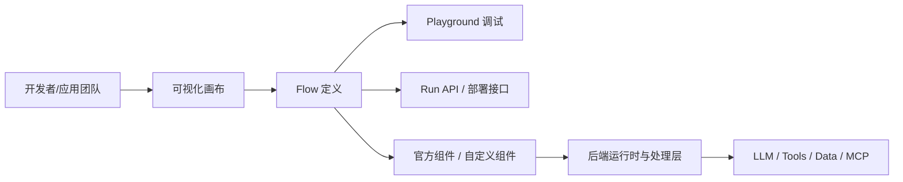
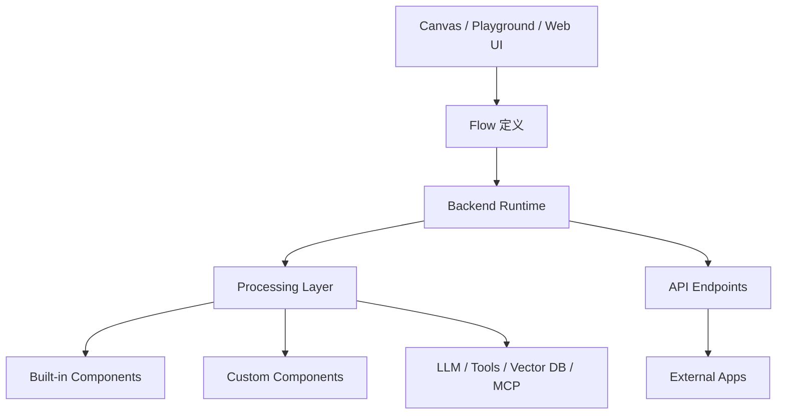

# langflow-ai/langflow 深度项目知识档案

## 项目元信息
- Source: https://github.com/langflow-ai/langflow
- Source type: github_repo
- Project type: ai_agent_workflow_builder
- Signal score: 57.0
- Status: final
- Confidence: high for product/doc facts; medium-high for source-level reconstruction
- Depth level: deep_dossier
- Last reviewed at: 2026-04-24
- Tags: ai, github, langflow, workflow, agent, visual-builder, api, custom-components, source-level

## 摘要

### TL;DR

Langflow 可以理解为一个面向 LLM 应用与 agent workflow 的可视化构建平台：它把模型、提示词、向量库、工具、MCP、agent 逻辑和 API 暴露整合到统一的图形化编排界面里，让用户既能用拖拽方式搭建流程，也能把流程发布成可运行接口。对学习者来说，Langflow 的价值不只是“低代码 UI”，而是它把应用原型、可复用组件、自定义 Python 组件、运行时执行和 API 化交付放到了同一个工作台里。

### 为什么这个项目值得深挖，而不是只看一眼

- 它站在“提示词试玩”与“完整 AI 应用工程化”之间，覆盖从原型搭建到部署交付的中间层。
- 它兼顾了两类人群：想快速试验 LLM 工作流的非纯工程用户，以及需要把工作流变成 API/产品能力的工程团队。
- 它不只是单个 agent 框架，而是“可视化编排 + 组件生态 + 运行 API + 自定义扩展”的组合体。
- 官方文档不只讲 UI，还讲 API、部署、MCP、组件和自定义扩展，这意味着它具备长期学习价值，而不只是 demo 工具。
- 源码层面可以看到它不是“纯前端画布工具”，而是明确存在后端运行时、API 路由、流程执行与处理层，因此适合做源码级补深。

### 关键结论

- Langflow 的核心定位不是“聊天产品”，而是 **AI workflow / agent workflow 的可视化构建与运行平台**。
- 官方文档显示它强调“可视化搭建 + 可复用组件 + API 部署 + 自定义组件”，因此它更像应用构建平台，而不是单一 SDK。
- 学习 Langflow 时，最应该先理解的是 **Flow、Component、Playground、API、Custom Component** 这五条主线。
- 仅靠 UI 体验无法真正掌握 Langflow；如果要深学，必须理解后端如何加载、执行和暴露 flow，以及自定义组件如何接入。
- 代码是这个项目的强信源之一，尤其是后端入口、API 路由和 processing 层，对判断系统真实结构很关键。

## 项目理解

### 它到底在解决什么问题

Langflow 解决的是：当团队希望把 LLM、retrieval、agent、tool、memory、MCP 等能力组合成一个真实可运行的应用流程时，如何避免一开始就陷入大量手写 orchestration 代码，同时又保留足够的可扩展性与部署能力。

从 README 与官方文档看，它试图把以下事情统一起来：

- 可视化搭建 AI workflow
- 复用官方和社区组件
- 在 Playground 中直接调试
- 将 flow 暴露为 API
- 用 Python 自定义组件扩展系统
- 接入外部模型与工具生态

这意味着 Langflow 的产品边界比“拖拽式 prompt 编排器”更大，它更接近一个 AI 应用构建台。

### 目标用户是谁

- 想快速搭建 LLM 工作流的开发者
- 需要把 agent / flow 交给团队协作维护的产品/应用团队
- 需要从可视化原型过渡到 API 化交付的工程团队
- 需要通过 Python 编写自定义节点、把业务逻辑嵌入流程的高级用户

### 核心概念解释

- **Flow**  
  Langflow 中的核心资产。一个 Flow 由多个组件节点与连线组成，表示从输入到输出的完整执行路径。学习 Langflow 的第一步就是理解“Flow 是构建单元、调试单元，也是部署单元”。

- **Component**  
  Flow 的基本节点。模型、Prompt、Parser、Tool、Agent、Vector Store、Memory、Loader 等都可以表现为组件。Langflow 的上手体验和扩展能力，很大程度都取决于组件体系是否清楚。

- **Playground**  
  用于交互式测试流程结果的运行界面。它不是单纯的 UI 装饰，而是用户从“搭建”过渡到“验证效果”的关键工作区。

- **API Deployment / Run API**  
  官方文档明确支持把 Flow 作为 API 运行。也就是说，Flow 不只是画出来给人看的图，而是能成为程序调用入口的运行对象。

- **Custom Component**  
  Langflow 的深度价值之一。官方文档支持用户用 Python 编写自定义组件，并通过约定方式加载到系统里，这决定了它不是封闭的低代码平台。

- **MCP**  
  官方文档有 MCP 相关章节，说明 Langflow 不只在做传统链式工作流，也在尝试接入更现代的工具与上下文协议生态。

- **Backend Processing**  
  从源码可以看到它存在独立的后端处理层与 API 路由，这说明真正的“运行时”并不在前端画布，而在服务端执行与调度层。

### 可对照项目

| 项目 | 更像什么 | 与 Langflow 的关键差异 |
| --- | --- | --- |
| Dify | 应用平台 / 工作流 + 知识库 + 运营面板 | Dify 更偏“产品化 AI 平台”，Langflow 更强调组件式 flow builder 与开发者工作台 |
| n8n | 通用自动化工作流平台 | n8n 的领域更广，Langflow 更聚焦 LLM / agent / prompt / retrieval 生态 |
| Flowise | 可视化 LLM 应用编排器 | Flowise 在用户心智上接近，但 Langflow 官方 docs 对 API、组件、MCP、定制化的组织更完整 |
| LangGraph Studio / LangSmith 相关体验 | LangChain 生态工作流可视化 | Langflow 不绑定单一底层框架，定位更偏独立应用构建平台 |

## 学习路径

### 推荐阅读顺序

1. 先读 README，确认它的官方定位、安装方式和使用入口。
2. 再读官方 `Overview / Components / Playground / API / MCP / Custom Components` 文档，建立产品心智。
3. 之后看部署文档，理解它不是“本地画图工具”，而是可服务化运行的平台。
4. 再下钻源码：先看后端入口与 API，再看 processing 层，而不是一开始就扫完整仓库。
5. 最后才去看具体业务扩展，例如自定义组件和外部集成。

### 建议先回答的四个问题

1. Flow 在 Langflow 里到底是“编辑对象”还是“运行对象”？  
2. Component 体系是不是它真正的护城河？  
3. API 与 Playground 是两套东西，还是同一运行结果的两种入口？  
4. 自定义组件如何从 Python 文件变成 UI 中可用的节点？

## 用户工作流

### 典型用户工作流

1. 启动 Langflow 或使用部署好的实例。
2. 在画布中拖入组件，连接成 Flow。
3. 在 Playground 中测试输入、观察输出。
4. 迭代组件配置、提示词与数据接线。
5. 将 Flow 暴露为 API，供外部系统调用。
6. 如果现有组件不够，再编写 Custom Component 注入业务能力。

### 工作流结构图



### 这个工作流为什么重要

- 它说明 Langflow 的核心对象是 Flow，而不是单条聊天消息。
- 它说明 Playground 与 API 不是割裂的，它们都围绕 Flow 运行。
- 它说明组件是系统扩展边界，自定义组件是高级用法的重要入口。

## 架构总览

### 一句话架构概括

Langflow 是一个“前端可视化构建 + 后端流程执行 + API 暴露 + Python 扩展组件”的 AI workflow 平台。

### 架构分层

1. **交互层**  
   画布编辑、Playground、管理界面等用户交互体验。

2. **Flow 定义层**  
   组件、节点、连线、参数配置，定义流程结构。

3. **运行执行层**  
   后端处理 Flow 执行、调度、数据流转与结果输出。

4. **API 服务层**  
   把 Flow 暴露成可调用接口，供外部程序使用。

5. **扩展层**  
   自定义组件、MCP、外部模型与工具接入。

### 架构图



### 架构逻辑说明

- 前端负责“定义”和“调试”流程，但执行主体在后端。
- 后端既要负责 API，也要负责流程实际运行，因此 processing 层是关键。
- 组件体系连接了产品体验与工程扩展能力，是 Langflow 这类平台最关键的中层。

## 关键模块与代码导览

### 关键目录

| Path | 作用 | 为什么重要 |
| --- | --- | --- |
| `src/backend/base/langflow/main.py` | 后端应用入口 | 它定义了服务如何启动、初始化和挂载，是理解系统不是“纯前端应用”的第一入口 |
| `src/backend/base/langflow/api/` | API 路由与接口层 | 这里决定了 Flow 如何被管理与调用，是“Flow 变成 API”的关键证据 |
| `src/backend/base/langflow/processing/` | 流程执行与处理层 | 这是理解实际运行逻辑的关键，不看这一层只会停留在 UI 心智 |
| `src/frontend/` | 前端画布与界面 | 它承载可视化体验，但不是唯一核心 |
| `docs/docs/` | 官方文档源文件 | 用来确认官方产品边界、API、部署和组件能力 |

### 关键源码入口

| Entry point | 作用 | Confidence |
| --- | --- | --- |
| `src/backend/base/langflow/main.py` | 后端主应用入口，负责初始化服务与挂载系统 | High |
| `src/backend/base/langflow/api/v1/endpoints.py` | 暴露 v1 API 路由，是“Flow/API 化”关键入口之一 | High |
| `src/backend/base/langflow/processing/process.py` | 后端处理流程执行逻辑的重要入口 | Medium-High |

### 为什么这些文件重要

- `main.py` 让我们确认 Langflow 不是“浏览器内玩具”，而是一个有正式后端服务入口的系统。
- `api/v1/endpoints.py` 让我们看到 API 不是文档里的营销词，而是明确存在的服务层结构。
- `processing/process.py` 代表真正的执行逻辑所在，它比前端画布更接近系统真实核心。

### 源码级分析是否适用

适用。因为这个项目不仅有完整 repo，还有明确的后端入口、API 路由、处理层和文档化的扩展机制。源码确实能显著提升理解深度。

### 源码级分析的限制

- 本轮没有穷举所有后端模块与前端状态管理细节。
- 本轮重点是“看清系统骨架”，不是深入到每一个执行分支。
- 对前端画布内部实现、数据库模型、认证细节仍保留 TODO。

## 配置与扩展

### 配置面

从 README 与文档可见，Langflow 支持本地运行、容器运行与部署，并且存在面向 API 与自定义组件的配置能力。官方文档还明确给出使用环境变量加载自定义组件路径的方式，例如 `LANGFLOW_COMPONENTS_PATH`。

### 扩展面

- **Custom Components**：用户可以用 Python 创建自己的组件，并让它们出现在 Langflow 工作台中。
- **MCP**：官方文档单独提供 MCP 章节，说明它有意连接更现代的工具协议生态。
- **API**：Flow 能暴露为接口，使它能进入正式应用链路。

### 这一层为什么关键

很多“可视化 AI 工具”只能搭 demo，但 Langflow 明显在强调“从搭建到交付”。扩展能力决定了它能不能从试验品进入真实业务。

## 多入口与运行形态

### Web

这是 Langflow 的主要入口。用户通过浏览器里的画布、组件面板与 Playground 进行搭建和测试。

### API

官方文档明确支持通过 `/api/v1/run/$FLOW_ID` 等形式运行 flow，这说明 Flow 可以成为程序消费的接口能力。

### CLI / Desktop / IDE

本轮主信源没有显示它像 OpenCode 那样把 CLI / IDE / Desktop 作为核心主入口，因此这里不强行展开。Langflow 的主入口仍然是 Web 与 API。

### 结论

Langflow 的运行形态更像：

```text
Web-first + API-enabled + Python-extension-friendly
```

而不是：

```text
CLI-first agent runtime
```

## 实战使用路径

### Quick Start

```bash
uv pip install langflow
uv run langflow run
```

上面这类启动方式来自 README 范围；如果要实际落地，仍建议以当前官方安装文档为准再执行。

### 推荐的第一轮上手练习

1. 安装并启动 Langflow，熟悉界面、组件面板与 Playground。
2. 用官方内置组件搭一个最小 flow：输入 -> 模型 -> 输出。
3. 把这个 flow 暴露成 API，并从外部请求验证它是否可运行。

### 推荐的第二轮上手练习

1. 加入一个检索或外部工具节点，观察 Flow 如何从简单生成扩展到多步流程。
2. 编写一个最小 Custom Component，验证 Python 扩展如何接入 UI。
3. 尝试阅读官方 MCP 文档，判断它是否适合你的工具接入场景。

### 推荐的第三轮深学练习

1. 结合源码查看 `main.py -> api -> processing` 的调用链，建立运行心智。
2. 对照文档与实际 API 行为，确认 Flow 作为“运行对象”的边界。
3. 研究组件体系与自定义组件加载机制，评估 Langflow 是否适合作为团队内部平台。

## 优势、局限与风险

### 优势

- 可视化构建和工程扩展兼得，适合从原型到交付的过渡期。
- 官方文档覆盖面较广，学习路径相对清晰。
- Custom Components 让平台不至于被内置节点能力锁死。
- API 化能力增强了它的真实应用价值。

### 局限

- 复杂 flow 很容易在 UI 中膨胀，后期维护成本可能上升。
- 可视化平台天然会面临“抽象层过厚”的问题，团队成员必须建立底层运行心智。
- 如果业务过度依赖自定义组件，最终可能又回到重工程实现，只是多了一层平台框架。

### 风险信号

- 高复杂度项目中，画布体验与后端执行一致性需要重点验证。
- 组件生态越大，版本兼容和升级路径越值得关注。
- 若团队只会“拖组件”，不会读 flow 运行逻辑，长期维护会出问题。

## 适合什么场景，不适合什么场景

### 适合

- 需要快速搭建和演示 AI workflow
- 需要让非纯后端工程人员参与 LLM 应用编排
- 需要把 workflow API 化供其它系统调用
- 希望在可视化平台里逐步引入自定义 Python 扩展

### 不太适合

- 团队已经有非常成熟的纯代码 orchestration 基础设施，且不想引入额外平台层
- 业务流程极度复杂、强依赖细粒度代码控制，且不希望画布抽象介入
- 只想做极轻量单次 prompt 调试，而不需要 flow / component / API

## 与同类方案的关系判断

### Fact

- Langflow 官方文档明确强调可视化 flow、组件、API、MCP 与自定义组件。
- Langflow 有明确后端入口、API 路由与处理层，说明它不是纯前端拼装器。

### Inference

- Langflow 更适合承担“AI 应用工作台”角色，而不是最底层 agent runtime。
- 它对团队协作式 AI workflow 开发会有吸引力，但长期价值取决于组件与执行层的稳定性。

### TODO

- 继续验证认证、权限、数据持久化与多用户协作层细节。
- 继续验证大型 flow 在生产环境中的调试与版本管理体验。

## 信源与置信度说明

### 本轮使用的主信源

- GitHub README
- 官方文档站
- 官方 Blog
- 后端入口源码
- API 路由源码
- Processing 层源码

### 置信度说明

- 对“产品定位、学习路径、API 化、自定义组件、MCP、部署能力”的判断：高
- 对“源码级系统骨架”的判断：中高
- 对“完整调用链、前端内部状态管理、权限/认证/数据库细节”的判断：仍需后续补深

## Links

- GitHub Repo: https://github.com/langflow-ai/langflow
- README: https://raw.githubusercontent.com/langflow-ai/langflow/main/README.md
- Docs Overview: https://docs.langflow.org/
- Components Docs: https://docs.langflow.org/components-custom-components
- API Docs: https://docs.langflow.org/api-openapi-api-examples
- MCP Docs: https://docs.langflow.org/mcp-model-context-protocol
- Deploy Docs: https://docs.langflow.org/deployment-docker
- Official Blog: https://www.langflow.org/blog/langflow-1-9
- Backend Main: https://github.com/langflow-ai/langflow/blob/main/src/backend/base/langflow/main.py
- API Endpoints: https://github.com/langflow-ai/langflow/blob/main/src/backend/base/langflow/api/v1/endpoints.py
- Processing Layer: https://github.com/langflow-ai/langflow/blob/main/src/backend/base/langflow/processing/process.py

## Raw Signal Snapshot

```json
{"repo_id": 16, "full_name": "langflow-ai/langflow", "url": "https://github.com/langflow-ai/langflow", "description": "Langflow is a powerful tool for building and deploying AI-powered agents and workflows.", "language": "Python", "license": "MIT", "latest_stars": 147275, "latest_forks": 8832, "latest_open_issues": 955, "stars_delta": 44, "forks_delta": 13, "score": 57, "reasons": ["stars_delta > 0: +5", "forks_delta > 0: +5", "stars > 10000: +10", "forks > 1000: +5", "has_license: +5", "has_language: +2", "ai_keyword_match: +15", "latest_commit within 14 days: +10"], "risks": []}
```
