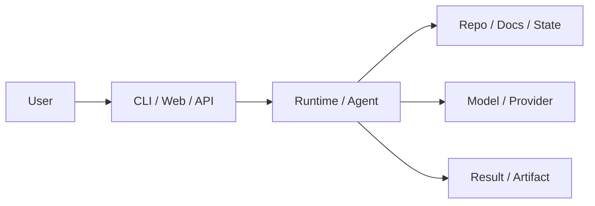
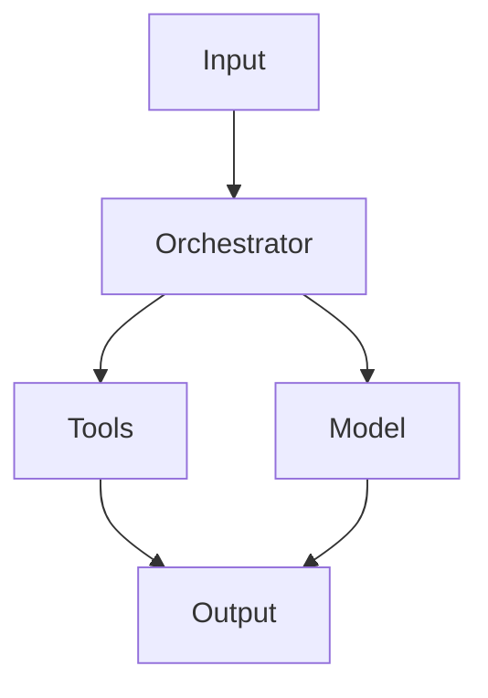

# Deep Project Dossier

## Metadata

- Source:
- Source type:
- Project type:
- Signal score:
- Status: draft
- Confidence: medium
- Depth level: deep_dossier
- Last reviewed at:
- Tags: ai, github, deep-dossier

## TL;DR

TBD

## Why It Matters

- TODO: What problem does this project solve?
- TODO: Why is it worth watching now?
- TODO: What changed recently?

## Problem And Users

### Problem

TBD

### Target Users

- TODO
- TODO
- TODO

### Use Cases

| Use case | User | Value |
| --- | --- | --- |
| TODO | TODO | TODO |

## Core Mechanism

### Main Idea

TBD

### Workflow



### Key Components

| Component | Role | Notes |
| --- | --- | --- |
| TODO | TODO | TODO |

## Architecture Notes

### Entry Points

- TODO: CLI / SDK / Web / API entry points

### Data Flow



### Important Files

| Path | Purpose | Notes |
| --- | --- | --- |
| TODO | TODO | TODO |

## Evaluation

| Dimension | Notes |
| --- | --- |
| Use case fit | TODO |
| Docs quality | TODO |
| Code quality | TODO |
| Activity | TODO |
| License | TODO |
| Community health | TODO |
| Learning value | TODO |
| Practical adoption difficulty | TODO |
| Risk | TODO |

## Hands-on Notes

### Quick Start

```bash
# TODO: commands tried locally
```

### What Worked

- TODO

### What Was Confusing

- TODO

## Limitations And Risks

- TODO: Maintenance risk
- TODO: Security or privacy risk
- TODO: Integration cost
- TODO: Product maturity

## Comparison

| Alternative | Difference | When to choose |
| --- | --- | --- |
| TODO | TODO | TODO |

## Learning Suggestions

1. TODO
2. TODO
3. TODO

## Links

- Repo:
- Docs:
- Release notes / changelog:
- Examples:
- Related blog / paper / announcement:

## Raw Signal Snapshot

```json
{}
```
