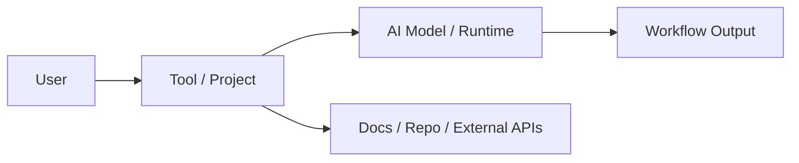

# Project Note Template

## Metadata

- Source:
- Source type:
- Signal score:
- Status: draft
- Confidence: medium
- Tags: ai, github, signal

## TL;DR

TBD

## Why It Matters

- TODO

## Quick Start

```bash
# TODO
```

## Core Concepts

- TODO

## Architecture



## Evaluation Notes

| Dimension | Notes |
| --- | --- |
| Use case | TODO |
| Docs quality | TODO |
| Code quality | TODO |
| Activity | TODO |
| License | TODO |
| Risk | TODO |

## Hands-on Notes

- TODO

## Links

- Source:
